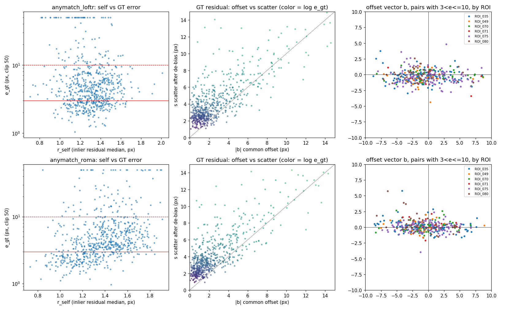

本实验在本数据集上 zero-shot 运行现有的多模态匹配方法与通用匹配方法，作为后续所有实验的比较起点。之后又用其中两个方法的结果，诊断 3 px 以内的失败来自哪里。

## zero-shot 基线

**实验目的**

本工作的出发点是：现有多模态匹配器在月球光学–SAR 影像上 zero-shot 效果不够好，但能提供一个好的起点。为了把「不够好」落到数字上，并为选择底座提供依据，把近年的方法在本数据集上统一重跑一遍，看各自的失败是什么样子。方法按三条标准挑选：优先最近、效果最好的方法；优先跨模态方法；也包括近年效果好的传统跨模态方法。

**实验方法**

所有方法都不训练，使用官方权重、官方默认分辨率和官方预处理，匹配结果统一用 RANSAC（3 px）估计仿射。方法分三类：

- 在多模态数据上微调过的匹配器：MatchAnything、MINIMA、AnyMatch 三篇数据引擎论文放出的全部权重，即 MatchAnything 的 ELoFTR、RoMa，MINIMA 的 SuperPoint + LightGlue、LoFTR、RoMa、ELoFTR、XoFTR，AnyMatch 的 LoFTR、EDM、RoMa；
- 原版匹配器：LoFTR、XoFTR、SuperPoint + SuperGlue、GeoFormer；
- 跨模态专用方法：RIFT2（传统方法，基于相位一致性）、RMSO-ConvNeXt（模板匹配网络）、CoMIR（对比学习得到两种模态的共享表示，再在表示上做 SIFT 匹配）。

「未配准」直接取恒等变换，作为下限。

输入统一处理：光学除以 255；SAR 取前两个波段之和转成 dB，截断到 −25 dB，再按每个 patch 自身的 2% 和 98% 分位数拉伸到 [0, 1]。两者都保持浮点，不量化。

有三个方法的接入需要说明。RMSO-ConvNeXt 官方只在 512 px 的光学图中找一个 256 px 的 SAR 模板；这里在 SAR 上按步长 32 取 9 × 9 个模板，每个模板的中心与它在光学图上找到的位置作为一对对应点。CoMIR 用官方在航拍 RGB–近红外数据上训练的模型，取官方刚体 RANSAC 之前的 SIFT 匹配。MINIMA 的 ELoFTR 没有官方推理代码，用 ELoFTR 的官方代码加载，配置是推断的。

每个方法接入后，先用光学图与它自身平移 (7, −5) px 的副本做自检，确认坐标换算正确。RMSO-ConvNeXt 的两个分支权重不同，不适用这个自检。

**实验结果**

各方法的失败方式分为四类。

| 类别 | 方法 | 每对匹配数中位 |
|---|---|---|
| 能粗配准 | AnyMatch-RoMa、MatchAnything-RoMa、AnyMatch-LoFTR、MINIMA-RoMa | 859–10000 |
| 中档 | GeoFormer、RMSO-ConvNeXt | 306、81 个模板 |
| 总能估出仿射，但几乎全错 | LoFTR、MatchAnything-ELoFTR、MINIMA-LoFTR、RIFT2、CoMIR | 68–2100 |
| 几乎不出匹配 | XoFTR、MINIMA-XoFTR、SuperPoint + SuperGlue、MINIMA-SuperPoint + LightGlue、AnyMatch-EDM、MINIMA-ELoFTR | 0–11 |

几乎不出匹配的六个方法在光学自检上都正常，换用另外两种 SAR 输入映射后仍然不出匹配（另一个实验）。

总能估出仿射的五个方法里，LoFTR、MatchAnything-ELoFTR、MINIMA-LoFTR 在 Val 上 56%–79% 的对误差超过 20 px，原版 LoFTR 的 AUC@10 甚至低于未配准。RIFT2 每对约 2100 个匹配，全部对的误差都超过 20 px；它的平移自检通过，不是接入问题。CoMIR 每对约 80 个匹配，RANSAC 内点只有 4 个左右，基本是随机匹配；分别换用表示的三个通道，结果相同。

中档的两个方法受精度限制。GeoFormer 的精匹配是离散的，在 480 px 的网格上以 2 px 为步长，自检就有约 1 px 的误差。RMSO-ConvNeXt 每个模板只估一个整像素的局部平移，81 个模板中位只有 10 个成为内点。

另有两处固有误差：MINIMA-ELoFTR 自检有 0.5–1 px 的误差，MatchAnything-ELoFTR 两侧有约 0.3 px 的不对称偏差。

SOMA（AAAI 2026）开源了代码，但没有发布权重，没有跑。

**实验结论**

只有在多模态数据上微调过的三个 RoMa 和 AnyMatch-LoFTR 可用：Val 上 10 px 内的成功率为 77%–87%，3 px 内只有 26%–30%。它们能粗配准，但精度不够，与本工作的出发点一致，可以作为训练的起点。其余方法要么几乎不出匹配，要么匹配几乎全错。不出匹配的方法换了输入映射也不出匹配，说明问题在模型本身认不出月球 SAR。

CoMIR 的结果只说明它不能 zero-shot 迁移到月球光学–SAR，不说明它在本数据上训练后的能力。

## 3 px 以内的失败来自哪里

**实验目的**

在设计不用标注的训练信号时，调研发现内点数、残差、匹配之间的一致性这类信号，只检查匹配自身是否自洽；整套匹配一起偏移时，它们全都满足。头部方法 10 px 内的成功率已有 85% 左右，3 px 内却只有 30% 左右。如果 3 px 以内的失败主要是这种整体偏移，这类信号就碰不到瓶颈。本诊断看这部分失败是整体偏移还是随机噪声。

**实验方法**

取 AnyMatch-LoFTR 和 AnyMatch-RoMa 在 Val 652 对上的结果，逐对计算四个量：

- 自洽残差：RANSAC 内点在估计仿射下的残差中位数；
- 真值误差：评价协议的误差，即人工检查点经估计仿射映射后的平均距离；
- 标注下限：只用这一对自己的 8 个检查点，最小二乘拟合一个仿射后的残差。任何仿射在这一对上的误差都不会低于它；
- 共同偏移：检查点残差的均值向量，即估计仿射相对检查点整体偏了多少。

按真值误差分档统计。

**实验结果**

AnyMatch-LoFTR 各档的中位数（px）：

| 真值误差档 | 对数 | 真值误差 | 自洽残差 | 标注下限 | 共同偏移 |
|---|---|---|---|---|---|
| 0–3 | 191 | 2.48 | 1.29 | 1.71 | 1.08 |
| 3–5 | 190 | 3.82 | 1.31 | 2.65 | 1.75 |
| 5–10 | 175 | 6.39 | 1.36 | 3.31 | 4.45 |
| 10–20 | 45 | 12.82 | 1.27 | 4.77 | 10.08 |
| 20 以上 | 51 | 104.21 | 1.18 | 2.92 | 103.56 |

AnyMatch-RoMa 的规律相同，自洽残差在各档都是 1.2–1.5 px。

在 3–10 px 档里，自洽残差与真值误差的 Spearman 秩相关只有 0.08（LoFTR）和 0.13（RoMa）。

全部对中，标注下限的中位数为 2.55 px，35% 的对超过 3 px；3–10 px 档里这一比例为 46%–47%。用其中 7 个检查点拟合仿射、预测第 8 个点，误差中位数为 3.8 px。去掉每对中残差最大的一个检查点后，超过 3 px 的比例降到 13%。

3–10 px 档的共同偏移集中在 x 方向：x 分量的标准差为 3.5 / 3.3 px（LoFTR / RoMa），y 分量只有 1.1 / 1.0 px；x 分量超过 2 px 的对占 56%–57%，y 分量超过 2 px 的只占 4%–7%。偏移的正负逐对变化，同一区域内也不同向。两个方法在同一对上的偏移部分一致（秩相关约 0.45）。

**实验结论**

3 px 以内的失败不是随机噪声。它主要来自两部分：一是标注本身，35% 的对任何仿射都过不了 3 px，所以 3 px 成功率的上限约为 0.65；二是沿 x 方向的逐对整体偏移。自洽残差在各档几乎不变，对这两部分都不敏感，只看匹配自身是否自洽的训练信号碰不到它们。

两个方法的偏移部分一致，推测偏移来自影像内容或标注，而不是某个网络本身，未经验证。x 方向是否对应 SAR 的距离向、偏移是地形引起的还是标注偏差，本诊断不能区分。
