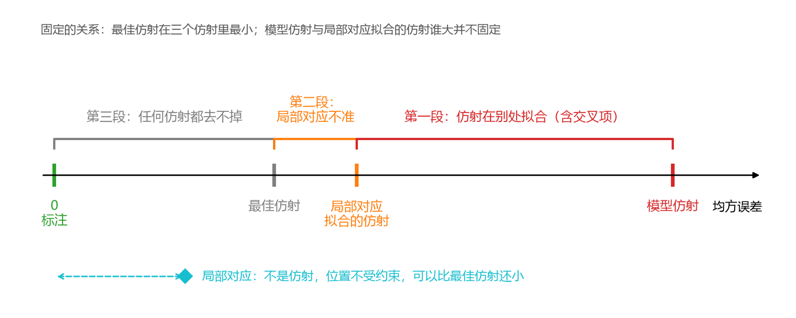
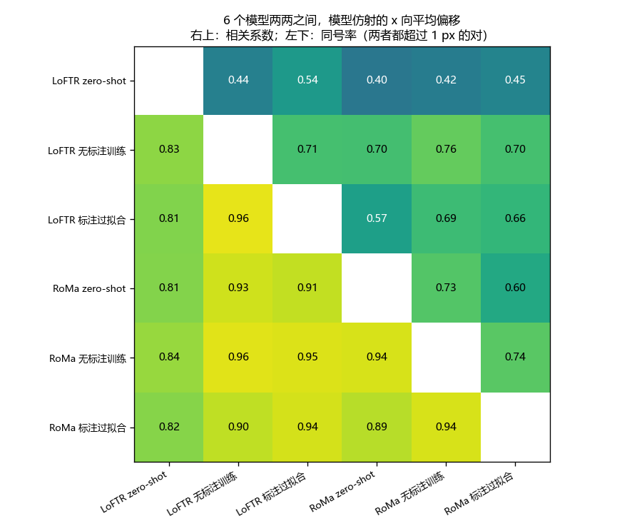
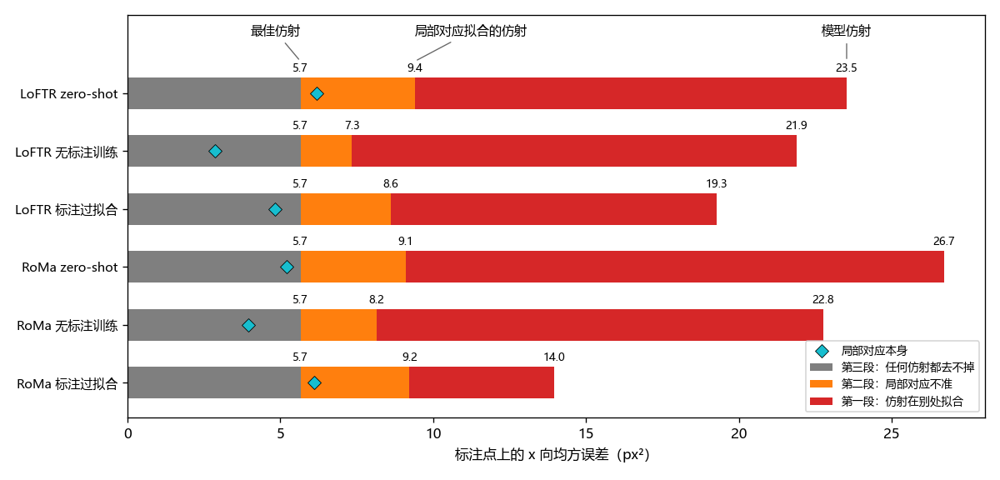

**实验目的**

两条无标注训练路线（离线伪标签迭代；训练时按当前模型的 RANSAC 结果给粗匹配打分）和 RoMa 的自训练，都在 Val AUC@5 约 0.29–0.31 处停住，只看评测数字已经看不出该往哪里改。

此前比较 LoFTR 和 RoMa 的预测时发现，两者在同一对图像上的 x 向误差 81–89% 同号，说明标注点处的误差有一部分来自这对图像本身，而不只是某个模型匹配得不好。另外，patch 对之间并不是严格的仿射关系：用每对自己的标注点拟合仿射，x 方向的残差远大于 y 方向，且与 SAR 入射角相关（x 轴大致是 SAR 的距离向）。

既然仿射不能完全描述一对图像之间的变换，用哪些位置的匹配来拟合仿射，就会影响仿射在其他位置的准确度。评测只在标注点（凭整体形状估出来的小陨石坑中心）上量误差，而模型的匹配铺满整张图，仿射主要由匹配最多的区域决定。由此猜想：模型在标注点处的匹配其实比评测误差显示的更准，只是仿射在其他地方拟合，到了标注点处反而偏了。若是这样，问题出在仿射的输出方式上；若模型在陨石坑上的定位本身有偏，问题出在匹配本身。两者对后续实验的指导完全不同。

本分析要回答：标注点处的误差，多少来自仿射在别处拟合，多少来自匹配本身。只推理、不训练，只用 Val 中 652 个有标注的对。

**实验方法**

研究对象是 6 个模型的 Val 预测，LoFTR 和 RoMa 各三个：AnyMatch zero-shot；无标注训练得最好的方法；用 Val+Test 标注过拟合的模型。误差都在标注点上量：把光学标注点映射到 SAR 上的位置，减去 SAR 上的标注位置。两个实验依次回答：误差里有多少是整对图像平移错了（实验一）；把仿射改在陨石坑处拟合，误差能降多少（实验二）。

实验一，误差的组成。一对图像的误差可以拆成两部分：平均偏移，即各点误差的平均，表示这一对整体平移错了多少；平移以外的误差，即各点误差减去平均偏移后剩下的部分。平均偏移超过 20 px 的对视为粗错，不参与后面的统计。

实验二，比较不同点对得到的误差。每对图像上有三组点对：

- 模型匹配：模型正常推理、经 RANSAC 筛选后的点对，模型输出的仿射（下称模型仿射）由它们估出；
- 局部对应：在每个标注点处取模型自己给出的匹配位置。LoFTR 取标注点周围 12 px 内、RANSAC 之前的匹配（至少 3 个），以它们位移的中位数作为该点的对应；RoMa 输出逐像素的稠密对应，直接在标注点处插值。与标注相差超过 20 px 的视为误匹配，不用；
- 标注：光学和 SAR 上的标注点。

在标注点上量四个误差：局部对应本身的误差，以及模型仿射、局部对应拟合的仿射、标注拟合的仿射（下称最佳仿射）的误差。最佳仿射是照着标注拟合的，任何仿射在这些点上都不会比它更准；局部对应不是仿射，不受这个限制。四个误差沿一根轴的位置如下图（示意）。

误差用 x 向均方误差，这样相邻两个仿射之间的差可以直接相减。为了让模型之间可以直接比较，只用 6 个模型都有局部对应的点：每对至少 4 个这样的点，任一模型粗错的对不计，共 291 对、1536 个点，各模型的最佳仿射因此相同。

**实验结果**

**实验一：误差的组成**

平均偏移只占均方误差的 16–30%，主体是平移以外的误差；但平均偏移几乎都在 x 方向，并且在模型之间一致。

| 模型 | 每对误差中位数 | 平均偏移中位数 | 平移以外的误差中位数 | 平均偏移占均方误差 | 平均偏移标准差 x / y | 粗错对数 |
|---|---|---|---|---|---|---|
| LoFTR zero-shot | 4.22 | 1.86 | 3.58 | 30% | 4.22 / 1.03 | 47 |
| LoFTR 无标注训练 | 3.49 | 1.51 | 3.21 | 26% | 3.25 / 0.72 | 3 |
| LoFTR 标注过拟合 | 3.40 | 1.33 | 3.20 | 26% | 3.24 / 0.67 | 3 |
| RoMa zero-shot | 3.75 | 1.59 | 3.41 | 29% | 3.78 / 1.32 | 23 |
| RoMa 无标注训练 | 3.39 | 1.28 | 3.16 | 26% | 3.20 / 0.57 | 9 |
| RoMa 标注过拟合 | 3.19 | 0.98 | 2.98 | 16% | 1.98 / 0.52 | 0 |

单位为 px。每对误差是各标注点误差长度的平均；平移以外的误差是各点到平均偏移的平均距离。平均偏移占均方误差的比例，就是对每对图像做一次完美的平移校正最多能去掉的比例。

LoFTR zero-shot 与其他模型的相关较低（0.40–0.54），其余模型两两之间为 0.57–0.76；标注过拟合的两个模型也同样一致。y 向平均偏移本身很小，相关较弱（0.18–0.91）。

**实验二：比较不同点对得到的误差**

x 方向上，只把仿射改在陨石坑处拟合，均方误差就降 55–66%；剩下的大部分是任何仿射都去不掉的，局部对应本身在 4 个模型上比最佳仿射还准。

若各模型用自己能取到局部对应的全部点（376–652 对），各项数值更大，且 6 个模型的局部对应都比最佳仿射准；其余关系不变。

**实验结论**

实验目的中的猜想在 x 方向得到支持：模型在陨石坑处的匹配比评测误差显示的更准，标注点处的误差大头来自仿射在别处拟合；这一点在 zero-shot、无标注训练和标注过拟合的模型上一致。局部对应能比最佳仿射还准，说明标注处确有仿射表达不了的形变，而模型在局部是跟上了的。由此推测，在当前的仿射输出方式下，提升匹配本身对陨石坑处精度的帮助有限，未经验证。

标注过拟合的 RoMa 是例外：它的模型仿射离局部对应拟合的仿射近得多（二者只差 4.7 px²，其他模型 10.7–17.6 px²）。推测是因为它的训练目标就是标注点拟合出的仿射，仿射被直接拉向标注处，未经验证。

本分析的局限有三点。局部对应本身也有误差：LoFTR 是 12 px 范围内匹配的中位数，RoMa 是在标注点处取样的稠密对应，都不是对陨石坑的精确定位；LoFTR zero-shot 的局部对应只覆盖约一半标注点。评测只在标注的陨石坑处量误差，模型仿射在陨石坑处不如局部对应拟合的仿射，不说明它在图上其他地方也更差。要让仿射在陨石坑处拟合，需要事先知道陨石坑的位置，能否用无标注的办法做到，没有检验。

后续检验支持上面的结论。在同样的 6 个模型上，从离陨石坑由近到远的距离圈里各取 40 个对应、用最小二乘拟合仿射，再在全部标注点上量误差：RoMa 无标注训练和两个标注过拟合的模型在离坑 32 px 以内拟合，误差接近这里的样本内拟合，比模型仿射低 33–49%，离坑越远误差越大。两个 zero-shot 模型和 LoFTR 无标注训练则在任何位置拟合都不如模型仿射。
