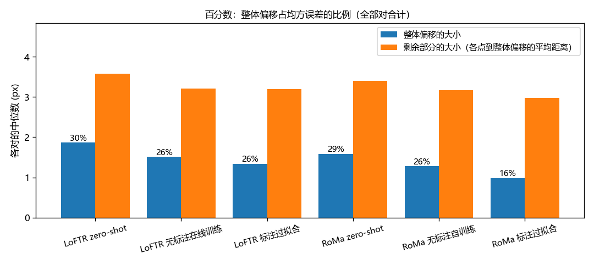
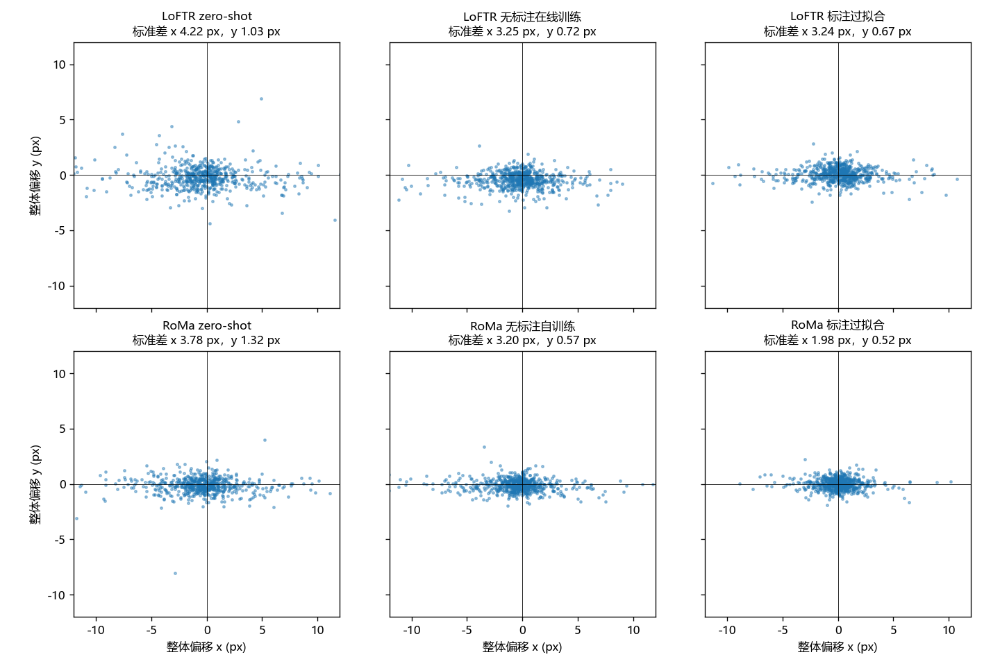
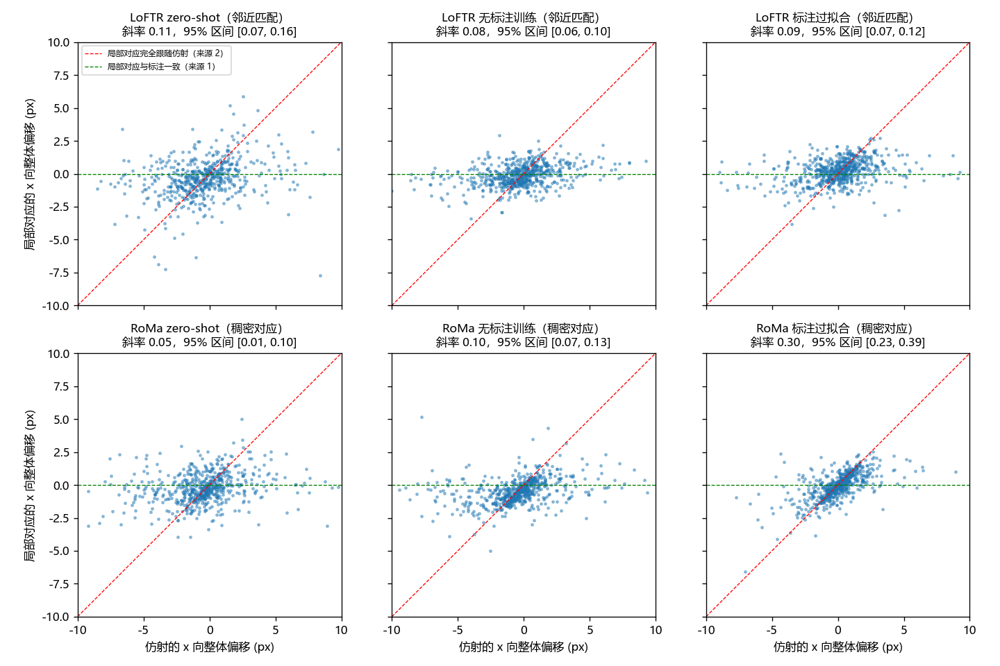
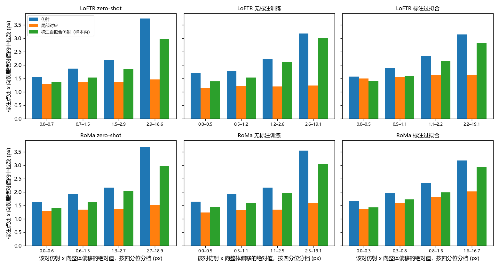
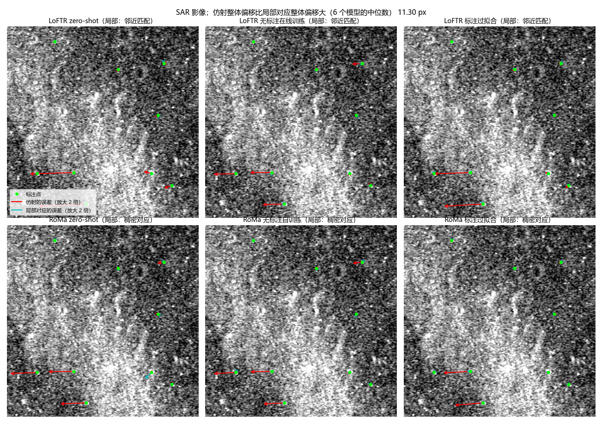
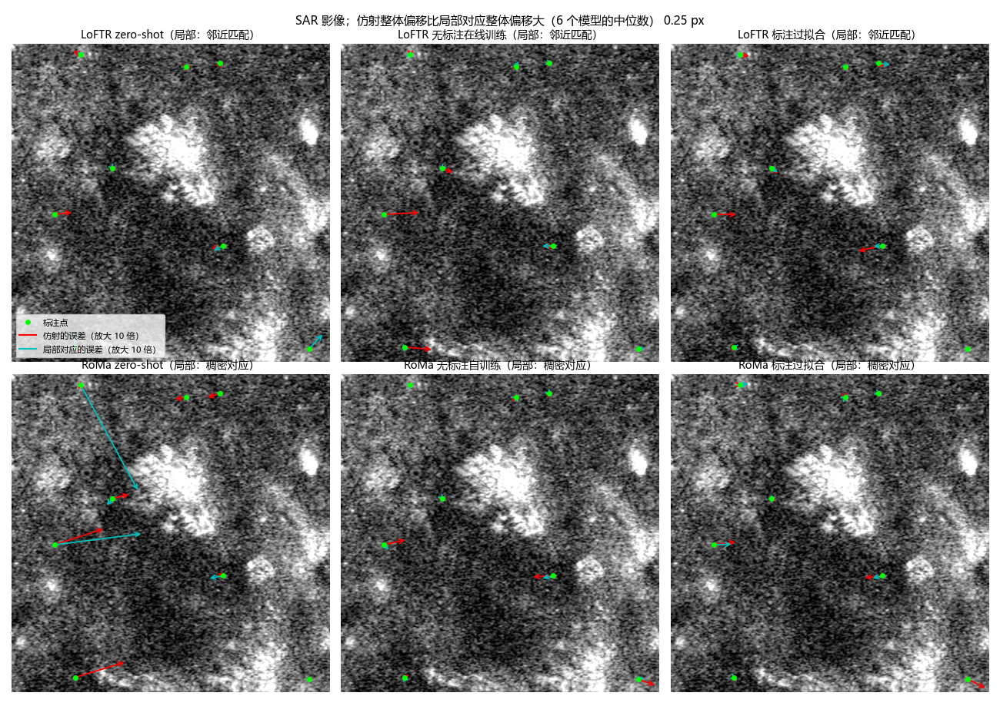
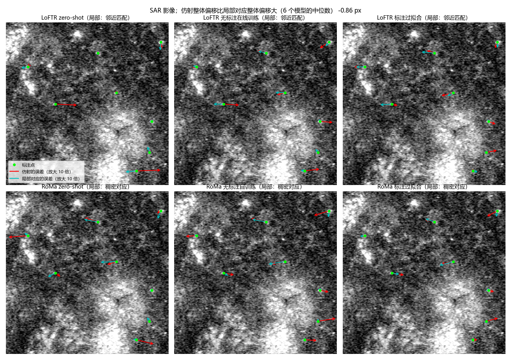

**实验目的**

两条无标注训练路线（离线伪标签迭代；训练时按当前模型的 RANSAC 结果给粗匹配打分）和 RoMa 的自训练，都在 Val AUC@5 约 0.29–0.31 处停住，只看评测数字已经看不出该往哪里改。此前比较 LoFTR 和 RoMa 的预测时发现，两者在同一对图像上的 x 向误差 81–89% 同号，说明有一部分误差是这对图像本身带来的，而不是某个模型特有的。

patch 对之间并不是严格的仿射关系：用每对自己的标注点拟合仿射，x 方向的残差远大于 y 方向，且与 SAR 入射角相关（x 轴大致是 SAR 的距离向）。标注点是凭整体形状估出来的小陨石坑中心。由此有两种可能的解释。一是模型依据的地物与标注不同：模型的匹配铺满整张图，仿射对准的是模型匹配最多的区域，在仿射表达不了的形变下，标注所在的陨石坑处就偏了。二是模型在陨石坑上的定位本身有偏。前者是仿射输出方式的问题，后者是匹配本身的问题，对后续实验的指导完全不同。

本分析先把误差描述清楚，再检验这两种解释哪一种有证据。只推理、不训练，只用 Val 的 652 个有标注的对。

**实验方法**

对 6 个模型逐对、逐个标注点比较三样东西：模型估出的仿射把光学标注点映射到 SAR 上的位置、模型在这个标注点附近自己给出的对应位置（下称局部对应）、SAR 上的标注位置。

6 个模型是 LoFTR 和 RoMa 各三个：AnyMatch 发布的多模态权重直接推理（zero-shot）；无标注训练得最好的方法（LoFTR 为训练时按当前模型 RANSAC 结果给粗匹配打分、外点扣 0.25 分、另加其他区域 SAR 组成的负样本对，第 1500 步；RoMa 为用自己的 RANSAC 仿射作伪标签训练，第 2000 步）；用 Val+Test 标注过拟合的模型（LoFTR 学习率 5e-5，第 14000 步；RoMa 同时解冻 VGG，第 16000 步）。仿射直接取各模型已有的 Val 预测。

误差的描述。一对图像上，各标注点误差向量（仿射映射位置减标注位置）的平均，表示这一对整体平移错了多少，下称平均偏移；各点误差减去平均偏移后剩下的部分，是平移以外的误差。这只是几何上的拆分，不对应上面两种解释。平均偏移超过 20 px 的对视为粗错，不进相关和回归。

局部对应的取法。LoFTR 只在粗网格上出匹配，取光学一侧落在标注点 12 px 以内的全部匹配（RANSAC 之前的，至少 3 个），把它们位移的中位数加到标注点上。RoMa 输出每个像素的稠密对应，直接在标注点处双线性取样。离标注超过 20 px 的局部对应视为误匹配，不用；LoFTR zero-shot 匹配稀疏且误匹配多，只有 60% 的标注点有局部对应，其中 21% 被滤掉，RoMa zero-shot 滤掉 19%，其余模型不超过 3%。另用 RoMa 的稀疏匹配按 LoFTR 的取法算了一遍，以及只用 RoMa 置信度高于中位数的点算了一遍，结果附在后面。

检验的思路：如果是第一种解释，局部对应应当贴近标注，误差小于仿射，而且仿射平移错了多少，局部对应并不跟着错；如果是第二种，局部对应和仿射一样偏，平均偏移跟着仿射走。具体看两个量。一是逐点的 x 向误差，并拿标注点自己拟合出的最佳仿射作参照：局部对应若比它还贴近标注，说明模型在局部看到了任何仿射都表达不了的形变。最佳仿射分两种算法，样本内（拟合时含该点，偏乐观）和留一（拟合时去掉该点）。二是逐对回归：局部对应的平均偏移对仿射在同一批点上的平均偏移做线性回归，斜率为 1 表示局部完全跟着仿射偏，为 0 表示局部不受仿射的偏移影响，区间由按对重采样 1000 次得到。

两处与评测一致性的核对：用存下的原始匹配重新做 RANSAC，得到的仿射与已有预测在标注点处相差不超过 0.0005 px；RoMa 稠密对应用同样的采样和 RANSAC 也复现了已有预测。RoMa 的输出与显卡型号有关：过拟合的 RoMa 在 V100 上推理，得到的仿射与当初在 RTX 3090 上评测的结果在标注点处中位相差约 3 px，所以每个模型都在当初评测所用型号的显卡上推理（过拟合的 RoMa 用 3090，其余用 V100）。

**实验结果**

误差的组成：

| 模型 | 每对误差中位数 | 平均偏移中位数 | 平移以外的误差中位数 | 平均偏移占均方误差 | 平均偏移标准差 x / y | 粗错对数 |
|---|---|---|---|---|---|---|
| LoFTR zero-shot | 4.22 | 1.86 | 3.58 | 30% | 4.22 / 1.03 | 47 |
| LoFTR 无标注训练 | 3.49 | 1.51 | 3.21 | 26% | 3.25 / 0.72 | 3 |
| LoFTR 标注过拟合 | 3.40 | 1.33 | 3.20 | 26% | 3.24 / 0.67 | 3 |
| RoMa zero-shot | 3.75 | 1.59 | 3.41 | 29% | 3.78 / 1.32 | 23 |
| RoMa 无标注训练 | 3.39 | 1.28 | 3.16 | 26% | 3.20 / 0.57 | 9 |
| RoMa 标注过拟合 | 3.19 | 0.98 | 2.98 | 16% | 1.98 / 0.52 | 0 |

单位为 px。每对误差是各标注点误差长度的平均，平移以外的误差是各点到平均偏移的平均距离。

6 个模型两两之间，x 向平均偏移的相关系数为 0.40–0.76（LoFTR zero-shot 与其他模型 0.40–0.54，其余 0.57–0.76）；在两者都超过 1 px 的对里，同号率为 81–96%。标注过拟合的两个模型也不例外。y 向平均偏移本身很小，相关较弱（0.18–0.91）。

两种解释的检验。x 向逐点误差为标注点处误差 x 分量绝对值的中位数（px）；跟随斜率为局部对应的平均偏移对仿射平均偏移的回归斜率；最后一列取仿射平均偏移最大的四分之一对，比较两者平均偏移的中位数。

| 模型 | x 向逐点误差：局部对应 | 仿射 | 最佳仿射（样本内） | 最佳仿射（留一） | 局部对应更近的点 | 跟随斜率 x | 跟随斜率 y | 偏移最大的四分之一对：仿射 → 局部 |
|---|---|---|---|---|---|---|---|---|
| LoFTR zero-shot | 1.38 | 2.10 | 1.80 | 2.93 | 62% | 0.11 [0.07, 0.16] | 0.57 | 4.68 → 1.46 |
| LoFTR 无标注训练 | 1.20 | 2.09 | 1.88 | 3.06 | 69% | 0.08 [0.06, 0.10] | 0.60 | 4.03 → 1.10 |
| LoFTR 标注过拟合 | 1.55 | 2.11 | 1.87 | 3.04 | 63% | 0.09 [0.07, 0.12] | 0.69 | 3.57 → 0.93 |
| RoMa zero-shot | 1.36 | 2.14 | 1.87 | 3.02 | 63% | 0.05 [0.01, 0.10] | 0.70 | 4.67 → 1.19 |
| RoMa 无标注训练 | 1.36 | 2.12 | 1.88 | 3.06 | 67% | 0.10 [0.07, 0.13] | 0.89 | 4.43 → 1.02 |
| RoMa 标注过拟合 | 1.67 | 2.16 | 1.91 | 3.11 | 67% | 0.30 [0.23, 0.39] | 0.93 | 2.52 → 1.17 |

按仿射平均偏移的大小把对分成四档，仿射在标注点处的 x 向误差随档位从约 1.6 px 升到 3.1–3.7 px，局部对应始终在 1.2–2.0 px，最佳仿射（样本内）介于两者之间。

只用 RoMa 置信度高于中位数的点时，跟随斜率 x 为 0.11（zero-shot）、0.18（无标注训练）、0.57（标注过拟合），比用全部点时高。

模型之间，局部对应的 x 向平均偏移仍有相关（0.24–0.70），两者都超过 1 px 的对里同号率 74–98%，但这样的对只有 55–112 个，局部对应平均偏移的标准差约 1 px，仿射约 3 px。

自动挑出的示意对，按 6 个模型的中位数计算「仿射平均偏移的长度减局部对应平均偏移的长度」，分别取最高、中位、最低的一对。绿点是标注，红色箭头是仿射的误差，青色箭头是局部对应的误差，箭头按图例中的倍数放大。最高的一对（11.3 px）左下部几个标注点处，6 个模型的仿射都向左偏 30–67 px，除 RoMa zero-shot 外，局部对应与标注相差不到 4 px；中位的一对两者差别不大；最低的一对局部对应与仿射偏向相同。

**实验结论**

误差中平移以外的部分是主体：平均偏移只占均方误差的 16–30%，这一部分即便有一个完美的平移校正也去不掉。平均偏移几乎都在 x 方向，并且是这对图像本身的性质：6 个模型之间同号率 81–96%，用标注过拟合也只是把 RoMa 的 x 向标准差从 zero-shot 的 3.8 px 压到 2.0 px，没有消除。

第一种解释（模型依据的地物与标注不同，仿射在仿射表达不了的形变下把标注处带偏）：支持，限于 x 方向。依据有三点。在标注点上，6 个模型的局部对应 x 向误差中位数为 1.2–1.7 px，小于仿射的 2.1 px，也小于用标注点自己拟合出的最佳仿射（样本内 1.8–1.9 px，留一 2.9–3.1 px），说明标注处确有仿射表达不了的形变，而模型在局部是跟上了的。仿射平移错得越多，局部对应并不跟着错，跟随斜率只有 0.05–0.11（标注过拟合的 RoMa 为 0.30）；在仿射平均偏移最大的四分之一对里，仿射偏 3.6–4.7 px，局部对应只偏 0.9–1.5 px（标注过拟合的 RoMa 为 2.5 px 和 1.2 px）。这些现象在 zero-shot、无标注训练和标注过拟合的模型上一致。由此推测，在当前的仿射输出方式下，提升匹配本身对标注处精度的帮助有限，这一点未经验证。标注过拟合的模型跟随斜率更高，推测是因为它的训练目标就是标注点拟合出的仿射，网络被推向按仿射对应，局部反而更跟着仿射走，未经验证。

第二种解释（模型在陨石坑上定位有偏）：看不出。局部对应相对标注还剩约 1 px 的平均偏移，在模型之间同号率高，说明 LoFTR 和 RoMa 在标注处有一致的局部偏差；但它与标注本身的偏差（人在 SAR 上估坑中心可能偏）无法区分，本分析只用标注作参照，判断不了是哪一方偏。y 方向的情况不同：局部对应基本跟着仿射走（跟随斜率 0.57–0.93），但 y 向平均偏移本身只有约 0.5–1 px，接近标注噪声，同样分不出来源。

本分析的局限：局部对应本身也有误差，LoFTR 是粗网格上 12 px 范围内的中位数，RoMa 是在标注点处取样的稠密对应，两者结论一致，但都不是对陨石坑的精确定位；LoFTR zero-shot 的局部对应只覆盖约一半标注点。

**补充：仿射误差的三段分解**

上面只说明了局部对应比仿射更贴近标注，没有回答仿射在标注处的误差有多少是因为它在别处拟合。为此在每对图像上，用同一组有局部对应的标注点（至少 4 个，筛选与上文相同）各拟合一个最小二乘仿射：一个把光学标注点拟合到局部对应上（下称局部对应拟合的仿射），一个拟合到标注上（即上文的标注点自拟合仿射）。模型仿射在每个点的误差于是分成三段：模型仿射与局部对应拟合的仿射之差，表示仿射是在模型匹配最多的地方拟合、而不是在标注所在的地方拟合造成的误差；局部对应拟合的仿射与标注点自拟合仿射之差，表示局部对应本身不准造成的误差；标注点自拟合仿射到标注的残差，表示任何仿射都去不掉的形变。后两个仿射拟合的是同一组点，第三段与前两段正交，所以三段的均方误差可以相加，只是前两段之间另有一个交叉项。局部对应拟合的仿射只用到标注点的位置，不用标注的 SAR 坐标，但实际使用时并不知道陨石坑在哪里，所以它是「在对的地方拟合」的上限，不是一个可用的方法。

| 模型 | 对数 / 点数 | x 向误差中位数：模型仿射 / 局部对应拟合 / 标注自拟合（样本内） | x 向均方根：模型仿射 / 局部对应拟合 / 标注自拟合 | x 向均方误差占比：第一段 / 第二段 / 交叉项 / 第三段 | 每对误差 < 3 px 的比例：模型仿射 / 局部对应拟合 / 标注自拟合 |
|---|---|---|---|---|---|
| LoFTR zero-shot | 376 / 1985 | 2.08 / 1.88 / 1.30 | 5.75 / 3.42 / 2.70 | 80% / 13% / −15% / 22% | 0.45 / 0.64 / 0.84 |
| LoFTR 无标注训练 | 646 / 4994 | 2.09 / 2.09 / 1.83 | 6.17 / 3.62 / 3.39 | 66% / 4% / 0% / 30% | 0.39 / 0.55 / 0.68 |
| LoFTR 标注过拟合 | 643 / 4894 | 2.11 / 2.04 / 1.79 | 5.66 / 3.64 / 3.29 | 61% / 8% / −3% / 34% | 0.42 / 0.56 / 0.70 |
| RoMa zero-shot | 581 / 4168 | 2.13 / 2.12 / 1.71 | 6.05 / 3.64 / 3.09 | 74% / 10% / −10% / 26% | 0.40 / 0.45 / 0.73 |
| RoMa 无标注训练 | 639 / 5119 | 2.12 / 2.12 / 1.87 | 6.01 / 3.77 / 3.41 | 59% / 7% / 2% / 32% | 0.42 / 0.53 / 0.67 |
| RoMa 标注过拟合 | 652 / 5279 | 2.16 / 2.16 / 1.90 | 4.88 / 3.93 / 3.48 | 30% / 14% / 6% / 51% | 0.46 / 0.51 / 0.65 |

单位为 px。每对误差是这组点上到标注的平均距离，与评测的每对误差算法相同，但只用有局部对应的点。LoFTR zero-shot 每对的点较少，标注自拟合仿射在样本内更乐观，不宜与其他行直接比较。

留一时，用其余点的局部对应拟合仿射去预测被留下的点，x 向误差中位数为 2.60–3.18 px，用其余点的标注拟合则为 3.06–3.22 px，六个模型都是前者略小。

从模型仿射换成局部对应拟合的仿射，x 向中位数几乎不变（LoFTR zero-shot 以外差别不超过 0.07 px），但均方误差降了 59–66%（标注过拟合的 RoMa 为 35%），每对误差小于 3 px 的比例从 0.39–0.46 升到 0.45–0.64。第一段集中在少数对上，与上文「仿射整体偏移最大的四分之一对」的现象一致。

在 x 方向的均方误差里，第一段即仿射在别处拟合造成的部分占 59–80%（标注过拟合的 RoMa 为 30%），局部对应本身不准的第二段只占 4–14%，任何仿射都去不掉的第三段占 22–34%（标注过拟合的 RoMa 为 51%）。也就是说，在仿射输出不变的前提下，标注处误差的大头来自仿射拟合的位置，而不是模型的匹配精度。这与上文「提升匹配本身对标注处精度的帮助有限」的推测方向一致。标注过拟合的 RoMa 第一段最小，与它跟随斜率最高的现象一致，推测是训练目标把它的仿射直接拉向标注处，未经验证。留一时局部对应拟合比标注拟合还略好，推测是标注点自身约 1 px 的噪声在留一外推时被放大，未经验证。

这一分解不能说明的地方：评测只在标注的陨石坑处量误差，第一段大只说明模型仿射在陨石坑处不如局部对应拟合的仿射，不说明它在图上其他地方也更差；要让仿射在陨石坑处拟合，需要事先知道陨石坑的位置，能否用无标注的办法做到没有检验。
