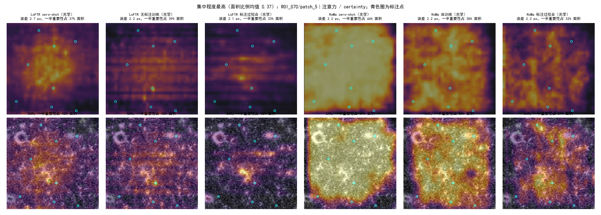
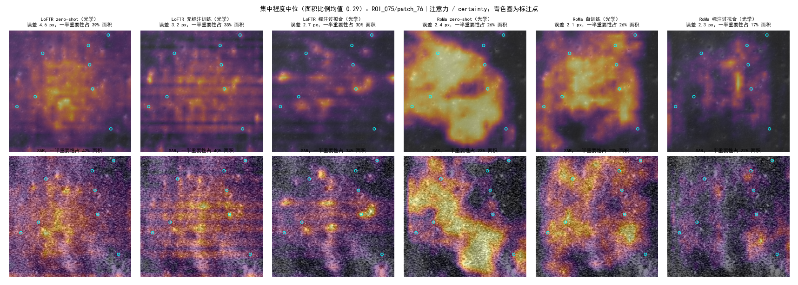
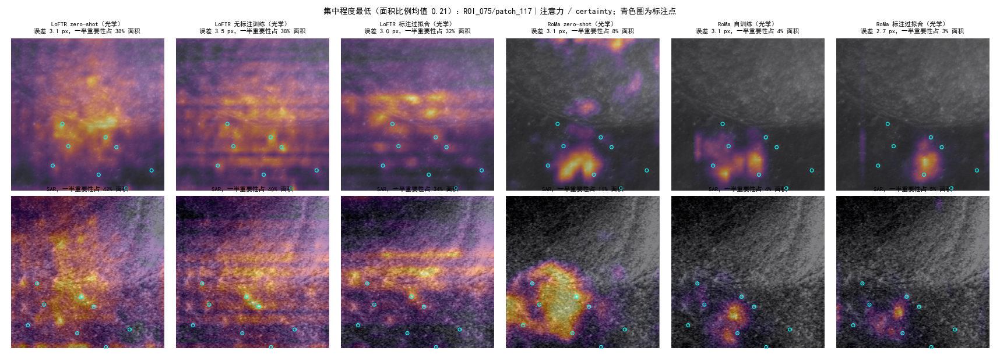
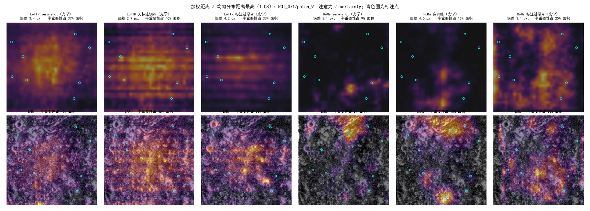
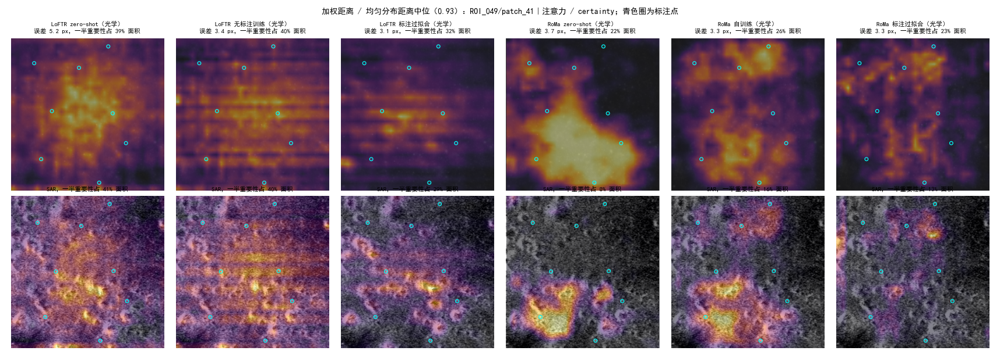
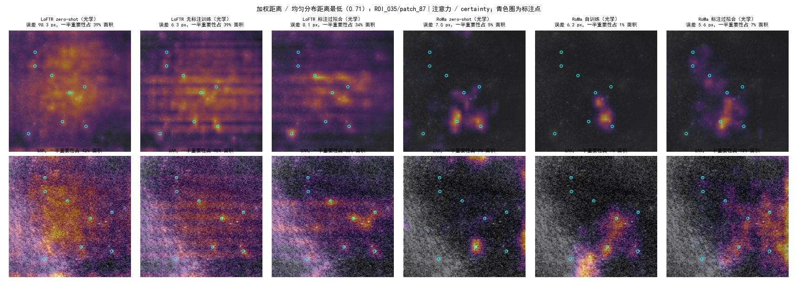
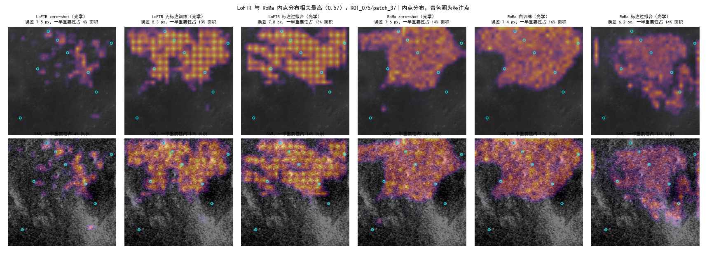
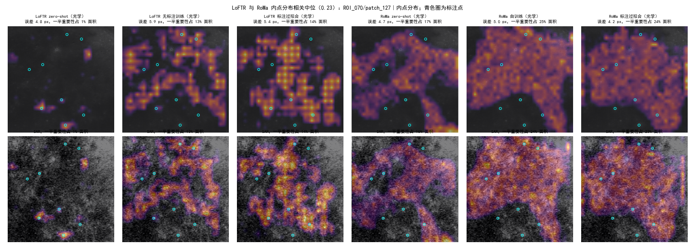
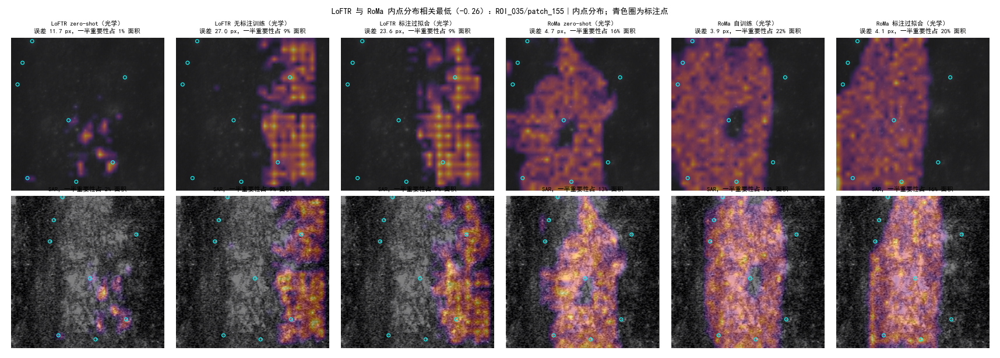

**实验目的**

两条无标注训练路线和 RoMa 的自训练都停在了相近的精度上，只看评测数字已经看不出下一步该改什么，于是转而分析现有模型的误差。起因是这样一个猜想：patch 对之间并不是严格的仿射关系，而标注点是人凭整体形状估出的小陨石坑中心；模型在估计仿射时依赖的可能是别的纹理，全局仿射对准了模型依赖的区域，在仿射表达不了的形变下，标注的坑处就偏了，这种偏差自训练修不掉。此前还发现 LoFTR 系和 RoMa 系相对标注的 x 向偏移在 81–89% 的对上同号，像是两类模型犯了同一种错。

本实验看三件事：模型主要看图上的什么地方；模型依赖的区域离标注点越远，这一对的误差是否越大；LoFTR 和 RoMa 看的是不是同样的地方。如果猜想成立，第二件事应当看到正相关。只推理、不训练，只用 Val 上有标注的 652 对，不预设模型应该看哪里。

**实验方法**

对 6 个模型各推理一次，从三种来源得到每对图上的「重要性」分布，再与图像属性、标注点位置和该对误差做统计。6 个模型是：AnyMatch 发布的 LoFTR 多模态权重（zero-shot）、在它上面用粗级闭式期望加负样本对做无标注训练的模型（第 1500 步）、用 Val+Test 标注过拟合的 LoFTR（学习率 5e-5）；AnyMatch 发布的 RoMa 权重（zero-shot）、用 RoMa 自己打的伪标签训练的模型（第 2000 步）、用 Val+Test 标注过拟合的 RoMa（解冻 VGG）。两个 RoMa 训练模型用的 SAR 输入是逐 patch 的 min–max 拉伸，所以 RoMa zero-shot 也取同一映射，三者只差在权重上。两个用标注过拟合的模型在 Val 上见过标注，只作参照。

三种重要性来源如下。

- 注意力与 certainty。LoFTR 粗级 transformer 的 8 层（自注意力与交叉注意力交替）都是线性注意力，记录每层、每张图上每个位置被所有查询关注的总量；这个量可以由查询和键的特征闭式算出，不需要显式的注意力矩阵。分析中取 4 个交叉注意力层的平均。RoMa 记录匹配输出的 certainty，光学和 SAR 两侧各一张。
- 内点分布。仿射 RANSAC（3 px）内点在各位置的个数。
- 遮挡敏感性。按 zero-shot 两个模型的整体偏移（各标注点误差向量的平均）大小把 652 对三等分（分界 1.4 px、3.3 px），小、中、大各随机取 20 对，大偏移的 20 对中 LoFTR 与 RoMa 的 x 向偏移同号、异号各 10 对。把光学图划成 16×16 块（每块 32 px），逐块用该图均值遮住，SAR 图同时遮住这块经该对标注点最小二乘拟合的仿射映射过去的位置，看估出的仿射变化多少。变化量是遮挡前后两个仿射在整张 patch 上 17×17 个网格点处映射结果的平均距离。

遮挡的做法在试跑后改过一处。评测用的仿射由 RANSAC 估出，而试跑发现，只给两张图加人眼看不出的高斯噪声（标准差 0.5/255），这个仿射就会变 1–3 px，比遮掉一块带来的变化还大，遮挡图几乎全是噪声。推测原因是 RANSAC 在几组相近的内点集合之间跳动。因此遮挡分析改用另一种估计：以不遮挡时的 RANSAC 仿射为起点，取残差小于 3 px 的对应做最小二乘，迭代 3 次；LoFTR 用全部匹配，RoMa 不再随机抽 10000 个点，而是用整张稠密对应、按 certainty 加权。每对另给不遮挡的图加 4 次独立的同样噪声，取变化量的均值作为该对的噪声底；每块的重要性取它的变化量减去噪声底，小于 0 的记 0。RANSAC 口径的变化量也一并记下。

所有重要性图统一成 32×32 格（每格 16 px）、和为 1，在光学和 SAR 两个坐标系里各算一遍（遮挡图的 SAR 侧按标注拟合的仿射搬过去）。「重要区域」是按重要性从高到低取格、累计到一半重要性为止的那些格，它占的面积比例称为集中程度，均匀分布时为 0.5，越小越集中。图像属性逐格计算：亮度；暗区占比；纹理强弱，即高斯平滑（σ = 1 px）后 Sobel 梯度幅值的格内均值除以全图均值。光学 patch 的对比度很低，几乎没有真正的阴影（低于该图亮度中位数 0.7 倍的像素不到万分之一），所以暗区取相对定义：低于该图第 10 百分位的像素，SAR 按 dB 同样处理。每对比较重要区域与其余区域的属性（纹理取对数比），在对之间用符号秩检验。

「依赖区域离标注点多远」用重要性加权的、各格到最近光学标注点的距离来衡量。标注点稀疏的对，任何位置离标注点都远，而这类对本身误差就偏大：均匀分布下的平均距离与误差的秩相关为 0.12–0.24。因此除直接的秩相关外，还报告控制均匀分布距离后的秩偏相关。误差是该对标注点经模型仿射映射后的平均距离，与评测协议相同。LoFTR 与 RoMa 的一致程度用同一对上两张重要性图（光学坐标系，32×32 格）的秩相关衡量，与随机配上的另外 5 对之间的秩相关比较；后者反映与具体图像无关的共同布局，例如都偏向图像中部。

推理在 V100 和 RTX 3090 上进行。与原评测在同一种 GPU 上推理的三个模型，仿射与已有记录基本逐对一致（99.5% 以上的对相差不到 0.1 px）；换了 GPU 的三个模型（两个无标注训练的模型和标注过拟合的 RoMa）逐对相差中位 0.4–0.9 px，这与上面 RANSAC 对微小扰动的跳动幅度相符，Val AUC@5 与记录相差不超过 0.003。下文的误差都按本次推理的仿射计算。

**实验结果**

*模型主要看什么地方。* 下图是三种来源的集中程度。LoFTR 粗级的注意力很分散，一半注意力摊在约 39% 的面积上；8 层之间差别不大（zero-shot 各层 0.32–0.41），用标注过拟合后变得集中一些（0.32）。RoMa 的 certainty 集中得多，zero-shot 为 0.25，自训练后 0.23，标注过拟合后 0.19。zero-shot LoFTR 的内点极为集中，一半内点落在 2% 的面积里，但它的内点数中位只有 208 个，训练后约 2000 个，集中程度主要反映内点少且成团，不宜与其他模型直接比较。遮挡敏感性在 LoFTR 上的集中程度为 0.09–0.12，即少数几块决定了大部分仿射变化。

遮挡的可靠程度在两类模型之间差别很大。LoFTR 的噪声底为 0.04–0.17 px，21–35% 的块的影响超过噪声底的两倍，遮挡图有信息量。RoMa 即使改用稠密对应，zero-shot 的噪声底仍有 0.85 px，大于遮挡变化的中位数 0.61 px，只有 2–9% 的块超过噪声底的两倍；有 5 对（三个 RoMa 模型合计）没有任何一块超过噪声底，另有 1 对重估计本身失败，都不计入。RoMa 遮挡图上的「集中」主要是减掉噪声底后剩下的零星几块，不代表模型真正依赖的区域。作为对照，按评测口径的 RANSAC 仿射，同样的微小噪声平均让仿射变化 0.56–1.81 px（60 对的中位数；zero-shot LoFTR 1.54 px，zero-shot RoMa 1.81 px）。

重要区域与其余区域的图像属性比较见下面两张图（上：注意力与 certainty；下：遮挡）。最一致的差别是纹理：注意力与 certainty 的重要区域在光学图上纹理更强，zero-shot LoFTR 平均强约 8%（82% 的对如此），无标注训练后约 12%（93%），标注过拟合后约 15%（95%）；zero-shot RoMa 约 7%（75%），自训练后约 2%（59%）。用标注过拟合的 RoMa 正好相反，重要区域的纹理弱约 10%，只有 11% 的对重要区域纹理更强。内点和遮挡给出的方向相同但幅度不一（遮挡下无标注训练的 LoFTR 与两个训练过的 RoMa 为 10–13%，zero-shot LoFTR 看不出差别）。重要区域的暗区占比略低，多数模型低 2.5–3.5 个百分点（相对于 10% 的平均水平）。亮度几乎没有差别：光学上重要区域与其余区域的亮度差都在 0.01 以内（亮度范围 0 到 1）；SAR 上只有标注过拟合的 LoFTR 明显偏向更亮的区域（高 0.07，93% 的对）。

集中程度最高、居中、最低的三对示意如下，每张图上排为光学、下排为 SAR，各列是 6 个模型的注意力或 certainty，青色圈为标注点。

*依赖区域离标注点越远，误差是否越大。* 6 个模型的重要性都比均匀分布更靠近标注点：加权距离与均匀分布距离之比，注意力与 certainty 为 0.87–0.98，内点为 0.76–0.93，遮挡为 0.90–0.99。对之间，直接的秩相关有正有负（注意力与 certainty 为 −0.14 到 0.23）；控制均匀分布距离之后，没有一个偏相关显著为正：注意力与 certainty 为 −0.16 到 0.03，内点为 −0.22 到 0.00，遮挡（约 60 对）为 −0.23 到 0.10 且都不显著。显著的几个是负的，例如标注过拟合的 LoFTR 的内点 −0.22、RoMa 自训练的 certainty −0.16，即模型依赖的区域相对更远离标注点的对，误差反而略小。下图每列一个模型，三行分别是三种来源，红线是按加权距离五等分后的平均误差。

加权距离与均匀分布距离之比最高、居中、最低的三对：

*LoFTR 与 RoMa 是否看同样的地方。* 注意力图与 certainty 图之间，同一对的秩相关（中位数 0.33，三组模型配对都在 0.33–0.34）与不同对之间（0.32–0.35）没有差别：两者的相似只是共同的空间布局，看不出在具体图像上看同一处。内点分布则在同一对上明显更像：zero-shot 时同一对 0.11、不同对 0.03，训练后 0.30 对 0.07，标注过拟合后 0.27 对 0.11；76–80% 的对高于不同对的中位数。遮挡图在 zero-shot 时同一对与不同对都约为 0.01，训练后为 0.11 对 0.01、0.06 对 0.00，但 RoMa 遮挡图噪声大，这一行只能作参考。

LoFTR 与 RoMa 内点分布的相关（三组模型配对的平均）最高、居中、最低的三对，各列为 6 个模型的内点分布：

**实验结论**

没有找到支持「模型依赖的区域离标注点越远，误差越大」的证据。6 个模型的重要性都略偏向标注点附近；在控制了标注点疏密之后，依赖区域到标注点的距离与该对误差的偏相关在 −0.23 到 0.10 之间，没有一个显著为正，显著的几个都是负的。以「模型依赖的地物与标注的坑错开、仿射表达不了中间的形变」来解释系统偏差，至少在这种按距离衡量的方式下看不出来；这并不排除依赖区域与标注点虽然不远、但落在不同地物上的情况，这一点需要按地物类别区分才能检验。

模型依赖的区域以纹理强弱为主要特征，与亮度基本无关，略避开最暗的部分。LoFTR 粗级的注意力很分散，RoMa 的 certainty 较集中；无标注训练让 LoFTR 更偏向纹理强的区域，用标注过拟合的 RoMa 则转向纹理弱的区域，原因不明。LoFTR 与 RoMa 在同一对上的内点分布有一定重合，训练后重合增加（秩相关 0.11 升到 0.30），而注意力与 certainty 之间看不出对应关系。

一个附带的发现是评测所用的 RANSAC 仿射本身不稳定：输入加上人眼看不出的噪声，仿射平均变化 0.6–1.8 px，换一种 GPU 推理也会逐对相差 0.4–0.9 px。这个幅度与 AUC@5 的 5 px 阈值相比不可忽略，推测单对误差中有相当一部分来自 RANSAC 的随机选择而非模型本身，未经验证；整体 AUC@5 受影响很小（换 GPU 后相差不超过 0.003）。

本实验不能下结论的地方：RoMa 的遮挡敏感性被噪声主导，无法说明 RoMa 依赖哪些区域；遮挡只做了 60 对，与误差的相关检验力有限；「重要性」的三种来源性质不同，注意力与 certainty 反映的是网络内部的权重，不一定等于仿射估计实际依赖的区域。
