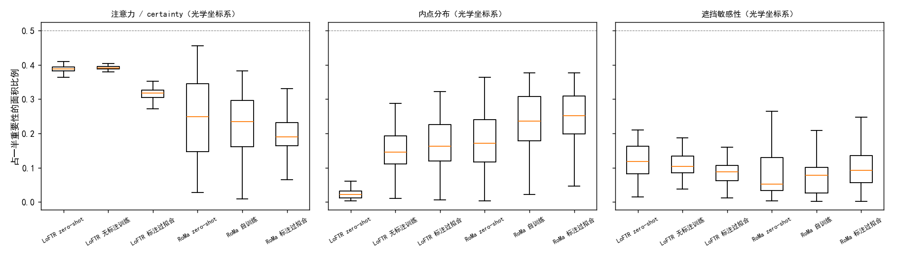
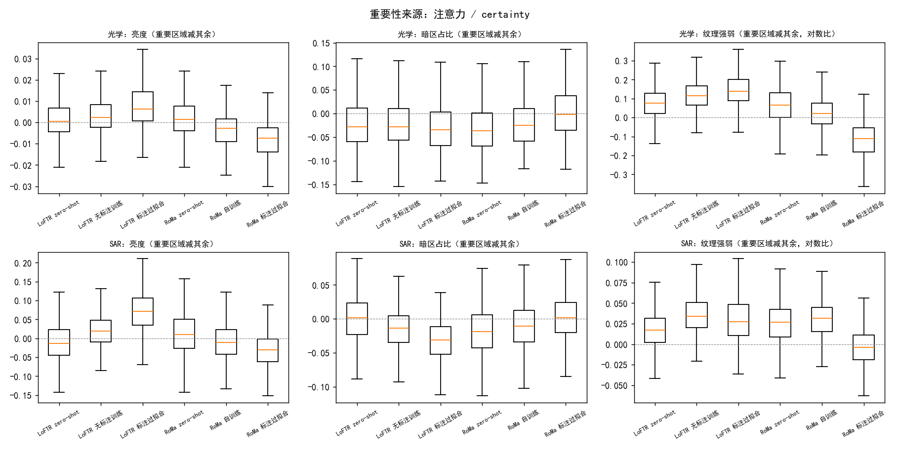
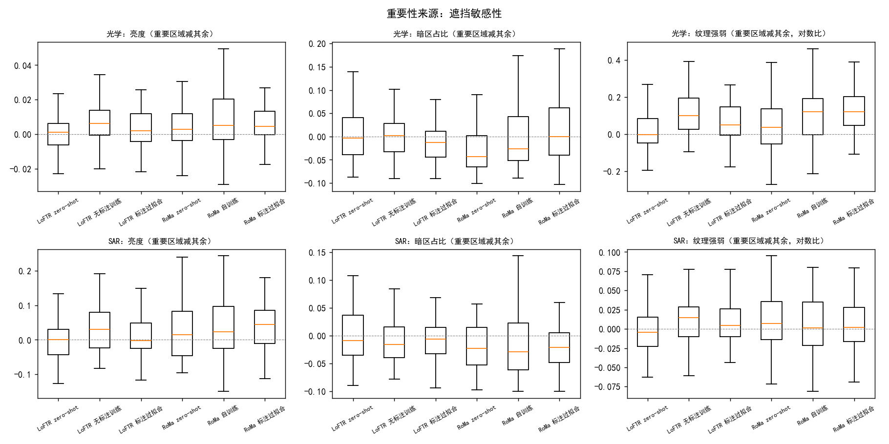
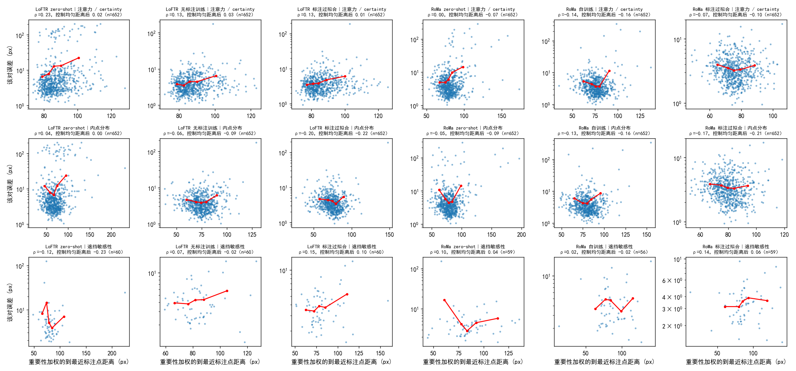
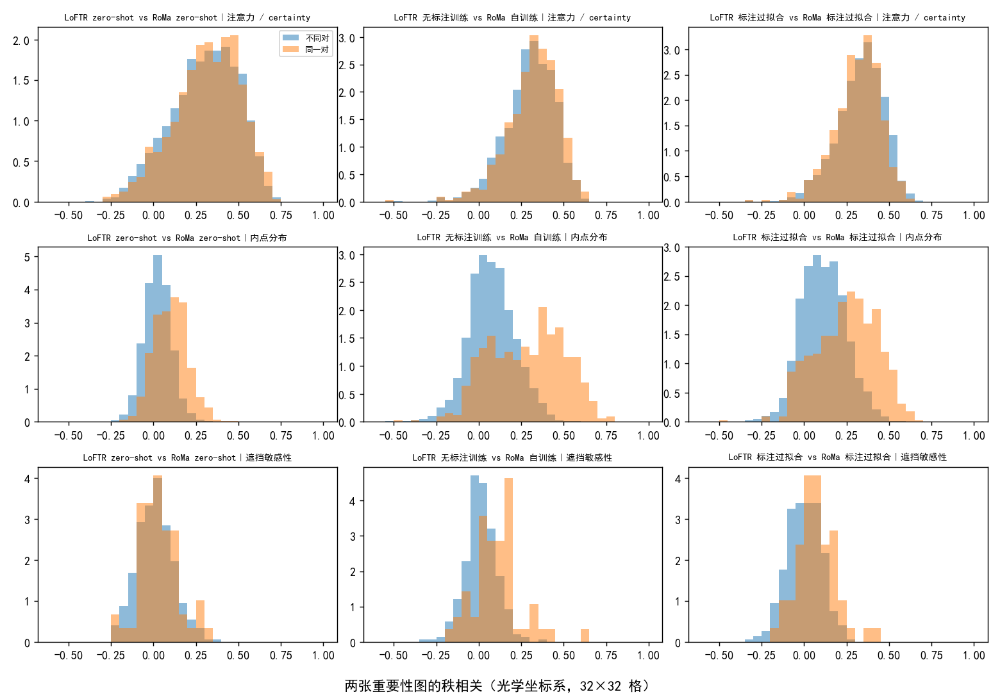

# 模型依赖的区域解释不了标注点处的误差

**摘要**

无标注训练能提高光学–SAR 匹配的精度，但两条无标注路线和 RoMa 的自训练都停在了相近的水平。一个可能的原因是：模型估计仿射时依赖的区域离评测用的标注点很远，而两张图之间的形变不是严格的仿射，全局仿射在标注点处就会偏。我们在 Val 的 652 对上，用注意力或 certainty、RANSAC 内点和遮挡三种方式，给 6 个 LoFTR 和 RoMa 模型画出了每对图上的依赖区域。控制标注点的疏密之后，依赖区域离标注点的远近与误差没有正相关。模型依赖的区域以纹理强为主要特征；LoFTR 与 RoMa 只在内点分布上依赖同样的区域。因此，标注点处的误差需要从依赖区域的位置以外去找原因。

**引言**

LoFTR 和 RoMa 都能在不用标注的情况下，靠伪标签或自训练在本数据集上提高精度。这些训练都停在 Val AUC@5 约 0.29–0.31，只看评测数字，已经看不出下一步该改什么。

停滞的原因可能在评测方式与形变的不匹配上。评测只在标注点上量误差，标注点是人凭整体形状估出的小陨石坑中心；而一对 patch 之间的形变并不是严格的仿射。模型若依赖别处的纹理来估计仿射，全局仿射就会对准那些区域，到了标注的坑处就偏了，这种偏差自训练修不掉。另一个现象也指向依赖区域：LoFTR 和 RoMa 相对标注的 x 向偏移在 81–89% 的对上同号，两类模型若依赖同样的区域，就可能犯同一种错。

我们检验这一解释。在 6 个模型上，我们画出每对图像上模型依赖的区域，比较这些区域的图像属性，检验它们离标注点的远近是否与误差有关，并比较 LoFTR 与 RoMa 是否依赖同样的区域。

**方法**

*模型与数据。* 6 个模型是 LoFTR 和 RoMa 各三个：AnyMatch 发布的权重（下称 zero-shot）；在其上不用标注训练得最好的模型（下称无标注训练；LoFTR 用粗级闭式期望加负样本对，第 1500 步；RoMa 用自己打的伪标签，第 2000 步）；用 Val+Test 标注训练的模型（下称标注过拟合；LoFTR 学习率 5e-5，RoMa 解冻 VGG）。三个 RoMa 模型用同一种 SAR 输入（逐 patch min–max 拉伸），只差在权重上。标注过拟合的模型在 Val 上见过标注，只作参照。所有统计都在 Val 中 652 个有标注的对上做，只推理、不训练。

*依赖区域。* 我们用三种方式衡量每个位置对仿射的重要性。第一种取网络内部的权重：LoFTR 粗级 4 个交叉注意力层上每个位置被关注的总量（线性注意力下可以闭式算出），RoMa 的 certainty。第二种取 RANSAC（3 px）内点在各位置的个数。第三种是遮挡：在 60 对上，把光学图逐块（32 px）遮住，SAR 图同时遮住对应的位置，量仿射的变化。评测用的 RANSAC 仿射在人眼看不出的噪声（标准差 0.5/255）下就会变 1–3 px，比遮掉一块的影响还大，所以遮挡改用一个更稳定的估计：从 RANSAC 仿射出发，对残差小于 3 px 的对应迭代 3 次最小二乘（RoMa 用整张稠密对应，按 certainty 加权）。每块的重要性是它带来的变化减去该对的噪声底，噪声底是 4 次加噪的平均变化。60 对按两个 zero-shot 模型的平均偏移大小分三档各取 20 对。

三种重要性都统一成 32×32 格、和为 1。从高到低累计到一半重要性的格构成重要区域；它占的面积比例衡量集中程度（均匀分布为 0.5）。

*图像属性。* 每格计算亮度、暗区占比（低于该图第 10 百分位的像素）和纹理强度（平滑后 Sobel 梯度的格内均值除以全图均值）。每对比较重要区域与其余区域，对之间用符号秩检验。

*与标注点的距离。* 各格到最近标注点的距离按重要性加权平均，得到加权距离；它除以均匀分布下的同一距离，得到距离比。标注点稀疏的对本身误差偏大，任何位置离标注点都远，所以我们报告控制均匀分布距离后，加权距离与误差的秩偏相关。误差是标注点经模型仿射映射后的平均距离。

*LoFTR 与 RoMa 的一致性。* 同一对上两张重要性图的秩相关，与随机配上的另外 5 对之间的秩相关比较；后者反映与具体图像无关的共同布局。

*可复现性。* 推理在 V100 和 RTX 3090 上进行。用同一种 GPU 的三个模型与评测记录逐对一致（99.5% 以上的对相差不到 0.1 px）；换了 GPU 的三个模型逐对相差中位 0.4–0.9 px，Val AUC@5 相差不超过 0.003。

**结果**

***LoFTR 的注意力分散，RoMa 的 certainty 集中。*** LoFTR 把一半注意力摊在约 39% 的面积上，8 层之间差别不大，标注过拟合后才集中一些（0.32）。RoMa 的 certainty 集中得多：zero-shot 0.25，无标注训练 0.23，标注过拟合 0.19。LoFTR zero-shot 的内点集中在 2% 的面积里，但这只是因为它的内点少（中位 208 个，训练后约 2000 个）。

图 1：LoFTR 的注意力分散，RoMa 的 certainty 集中。纵轴为集中程度，越小越集中。

***只有 LoFTR 的遮挡图可信。*** LoFTR 的噪声底只有 0.04–0.17 px，21–35% 的块影响超过噪声底两倍。RoMa zero-shot 的噪声底却有 0.85 px，超过遮挡变化的中位数 0.61 px，只有 2–9% 的块超过噪声底两倍。RoMa 遮挡图上的集中因此只是噪声减剩的零星几块。同样的噪声让评测用的 RANSAC 仿射变化 0.56–1.81 px，可见评测仿射本身也不稳定。

*模型依赖纹理强的区域。* 重要区域在光学图上纹理更强：LoFTR 从 zero-shot 的 8%（82% 的对）到无标注训练的 12%（93%）、标注过拟合的 15%（95%）；RoMa zero-shot 7%（75%），无标注训练 2%（59%）。唯一的例外是 RoMa 标注过拟合，它的重要区域纹理反而弱约 10%。重要区域的暗区占比略低（低 2.5–3.5 个百分点，平均水平 10%），亮度则几乎没有差别（光学上相差不到 0.01）。哦

图 2：注意力与 certainty 的重要区域纹理更强，亮度无差别。

图 3：遮挡给出相同方向的纹理差别（LoFTR 无标注训练与两个训练后的 RoMa 为 10–13%）。

***依赖区域离标注点的远近与误差无关。*** 6 个模型的重要性都略偏向标注点（距离比 0.76–0.99）。控制标注点疏密之后，加权距离与误差的偏相关在注意力与 certainty 上为 −0.16 到 0.03，在内点上为 −0.22 到 0.00，在遮挡上为 −0.23 到 0.10；没有一个显著为正。显著的几个反而是负的。

图 4：依赖区域离标注点更远的对，误差并不更大。

*LoFTR 与 RoMa 只在内点上依赖同样的区域。* 注意力与 certainty 之间，同一对的相关（0.33）与不同对之间（0.32–0.35）相同，两者的相似只是共同的布局。内点在同一对上明显更像：zero-shot 时 0.11 对 0.03，无标注训练后 0.30 对 0.07，标注过拟合后 0.27 对 0.11。

图 5：内点分布在同一对上比在不同对之间更像，注意力与 certainty 则不然。

**讨论**

我们检验了「模型依赖的区域远离标注点，导致标注点处误差大」这一解释，结果不支持它。6 个模型的依赖区域都略偏向标注点，控制标注点疏密之后，远近与误差的偏相关没有一个显著为正。依赖区域的位置因此解释不了训练的停滞；LoFTR 与 RoMa 的内点分布虽有重合，这种重合与两者的同号偏移有无关系，本研究没有检验。

我们的结论有三点局限。RoMa 的遮挡被噪声主导，说明不了 RoMa 依赖哪些区域。遮挡只做了 60 对，检验力有限。注意力与 certainty 反映的是网络内部的权重，不一定等于仿射估计实际依赖的区域。

两个发现值得后续检验。第一，按距离衡量排除不了依赖区域虽然离标注点不远、却落在不同地物上的情况，检验它需要按地物类别区分。第二，评测用的 RANSAC 仿射在微小扰动下变化 0.6–1.8 px，与 AUC@5 的 5 px 阈值相比不可忽略；单对误差中可能有相当一部分来自 RANSAC 的随机选择，而不是模型本身。
