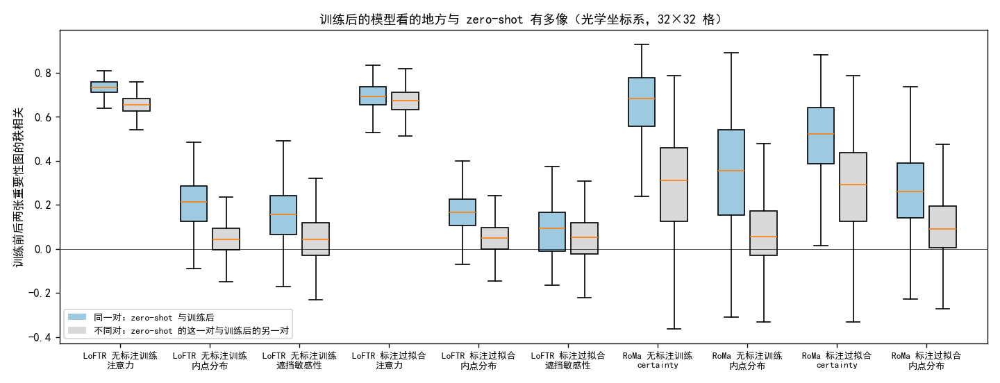

**实验目的**

前两个误差分析分别描述了每个模型误差的性质和它看图上的什么地方，结论在 zero-shot、无标注训练和用标注过拟合的模型上大体一致：标注点处的 x 向误差大头来自仿射在别处拟合，模型依赖纹理强的区域，依赖的区域离标注点远近与误差无关。这些都是对单个模型的描述。无标注训练提高了 Val AUC@5，但它改变了模型的哪些方面，没有在同一批图像对上直接比较过；用标注训练得更好的模型，改变的是否也是这些方面，同样不清楚。

本分析要回答：训练改变了模型的什么，用标注训练和不用标注训练改变的是不是同一类东西。

**实验方法**

本分析把 zero-shot 和训练后的模型放在同一批 Val 对上逐对比较，只读已有结果，不推理、不训练，只用 Val 上有标注的 652 对。比较四组：LoFTR 和 RoMa 各自从 zero-shot 到无标注训练、从 zero-shot 到用 Val+Test 标注过拟合。六个模型与前两个误差分析相同：LoFTR zero-shot 是 AnyMatch 发布的多模态权重，LoFTR 无标注训练是粗级闭式期望加负样本对的方法（第 1500 步），LoFTR 标注过拟合是学习率 5e-5 的那次；RoMa zero-shot 是 AnyMatch 发布的权重（SAR 输入逐 patch min–max 拉伸），RoMa 无标注训练是用 RoMa 自己打的伪标签训练的方法（第 2000 步），RoMa 标注过拟合是解冻 VGG 的那次。标注过拟合的两个模型在 Val 上见过标注，只作参照。实验一回答训练改变了误差的哪一部分，实验二回答训练改变了模型看的地方没有；两个实验都把无标注训练和标注过拟合并排比较，并检验两者是否让同一批对朝同一方向变。

实验一用评测记录的仿射，沿用第一个误差分析的定义。一对图像在各标注点上的误差是光学标注点经仿射映射后减去 SAR 标注点；各点误差的平均称为平均偏移，减去平均偏移后剩下的称为平移以外的误差。一对的均方误差恰好等于平均偏移的平方加上平移以外的误差的均方，按 x、y 分开就得到四个部分。平均偏移某一轴超过 20 px 的对视为粗错。每组只用训练前后都不是粗错、也没有失败的对，比较四个部分的均方误差（各对等权平均）怎么变，以及同一对的 x 向平均偏移在训练前后的关系。

接着在标注点上比较三种 x 向误差：模型仿射的误差、局部对应拟合的仿射的误差、局部对应本身的误差。局部对应是模型在每个标注点处自己给出的匹配位置：LoFTR 取标注点 12 px 内匹配位移的中位数，RoMa 在标注点处对稠密对应插值；用一对的局部对应做最小二乘，得到局部对应拟合的仿射。这里只用 6 个模型都有局部对应的点，共 291 对、1536 个点，与第一个误差分析相同；各模型用标注拟合的仿射（最佳仿射）因此相同，它的 x 向均方误差是 5.7 px²。

实验一最后检验两种训练是否让同一批对朝同一方向变。直接拿两者各自的「训练后减 zero-shot」做相关会虚高，因为两者共用同一个 zero-shot 项。因此先把每个训练后模型的量对它自己的 zero-shot 做线性回归，取残差，即训练带来的、zero-shot 预测不了的部分；两份残差的相关下称残差相关。量取 x 向平均偏移和每对误差的对数。作为对照，同样计算 LoFTR 与 RoMa 两个无标注训练模型之间、两个标注过拟合模型之间的残差相关：两者网络和起点都不同，共有的变化只能来自图像对本身。

实验二用第二个误差分析的那次推理，误差也按那次推理的仿射计算，并沿用它的定义。每对图上的重要性图统一成 32×32 格、和为 1，来源有三种：LoFTR 粗级交叉注意力层的被关注总量（下称注意力）和 RoMa 的 certainty；RANSAC 内点的分布（下称内点）；LoFTR 在 60 对上的遮挡敏感性（RoMa 的遮挡图被噪声主导，不比）。集中程度是累计到一半重要性所需的面积比例，越小越集中；纹理偏好是重要区域比其余区域的平均纹理强度高出的比例；距离比是重要性加权的、各格到最近标注点的距离与均匀分布下这一距离之比，越小越靠近标注点。以上都在光学坐标系里计算。逐对比较的量有：训练前后两张重要性图的秩相关，对照 zero-shot 的这一对与训练后随机 5 个另外的对之间的秩相关；集中程度、纹理偏好、距离比在训练前后的配对变化，用符号秩检验；距离比的变化与误差变化之间的秩相关；LoFTR 与 RoMa 在同一对上两张重要性图的秩相关在训练前后的配对变化。两种训练是否让重要性图朝同一方向变，做法与实验一相同：每张训练后的图（取秩）对同一对的 zero-shot 图（取秩）回归取残差，比较同一对上两份残差的相关和不同对之间的相关。

**实验结果**

**实验一：误差怎么变**

训练修好了大部分粗错，在其余对上让误差的四个部分一起下降，有标注与无标注训练的降幅构成几乎相同。

| 比较 | 粗错和失败（对）前 → 后 | 比较的对数 | 均方误差（px²）前 → 后 | x 向平均偏移占降幅 | x 向平移以外的误差占降幅 | y 向两部分占降幅 |
|---|---|---|---|---|---|---|
| LoFTR 无标注训练 | 47 → 3 | 605 | 63.7 → 40.7 | 37% | 59% | 4% |
| LoFTR 标注过拟合 | 47 → 3 | 604 | 63.5 → 37.7 | 35% | 60% | 5% |
| RoMa 无标注训练 | 23 → 9 | 627 | 54.0 → 39.6 | 29% | 53% | 18% |
| RoMa 标注过拟合 | 23 → 0 | 629 | 55.5 → 25.5 | 37% | 54% | 9% |

训练后新出现的粗错只有 0–2 对。降幅的构成与误差本身的构成相近（第一个误差分析中，平均偏移占均方误差的 16–30%），训练没有专门去掉平均偏移。

同一对的 x 向平均偏移在训练后变小，但方向基本保留。x 向平均偏移的标准差，LoFTR 从 4.2 px 降到 3.1 px（无标注训练）和 3.0 px（标注过拟合），RoMa 从 3.7–3.8 px 降到 3.0 px 和 1.9 px；训练前后都超过 1 px 的对中，81–94% 同号。下图的回归斜率只有 0.30–0.60，但 zero-shot 的平均偏移本身带有 RANSAC 随机选择造成的抖动（第二个误差分析测得 0.6–1.8 px），会压低斜率，所以变化幅度以标准差为准。

在标注的陨石坑处，LoFTR 无标注训练改进的是局部对应，标注过拟合改进的是仿射本身。下表是 291 对公共点上的 x 向均方误差（px²），括号里是这一误差变小的对所占比例。

| 模型 | 模型仿射 | 局部对应拟合的仿射 | 局部对应本身 |
|---|---|---|---|
| LoFTR zero-shot | 23.5 | 9.4 | 6.2 |
| LoFTR 无标注训练 | 21.9（58%） | 7.3（70%） | 2.9（77%） |
| LoFTR 标注过拟合 | 19.3（60%） | 8.6（47%） | 4.8（45%） |
| RoMa zero-shot | 26.7 | 9.1 | 5.2 |
| RoMa 无标注训练 | 22.8（62%） | 8.2（50%） | 4.0（51%） |
| RoMa 标注过拟合 | 14.0（71%） | 9.2（48%） | 6.1（43%） |

LoFTR 无标注训练后，局部对应本身的误差降了一半多（77% 的对变好，符号秩检验 p < 10⁻²⁴），局部对应拟合的仿射也随之变好；模型仿射却只从 23.5 降到 21.9，它与局部对应拟合的仿射之差从 14.1 变为 14.5 px²，没有缩小。两个标注过拟合的模型相反：局部对应和局部对应拟合的仿射逐对看都没有显著变化（p 0.12–0.73），RoMa 的局部对应还略变差（p < 10⁻⁴）；模型仿射则明显变好，它与局部对应拟合的仿射之差 LoFTR 从 14.1 缩到 10.7 px²，RoMa 从 17.6 缩到 4.7 px²。RoMa 无标注训练介于两者之间：模型仿射变好，局部对应的均方误差变小，但逐对看没有显著变化（p 0.38）。

同一网络的两种训练让同一批对朝同一方向变，残差相关明显高于不同网络之间。

| 比较的两个模型 | 对数 | x 向平均偏移的残差相关 | 误差（对数）的残差相关 |
|---|---|---|---|
| LoFTR 无标注训练 与 LoFTR 标注过拟合 | 604 | 0.61 | 0.69 |
| RoMa 无标注训练 与 RoMa 标注过拟合 | 627 | 0.52 | 0.74 |
| LoFTR 无标注训练 与 RoMa 无标注训练（对照） | 592 | 0.34 | 0.31 |
| LoFTR 标注过拟合 与 RoMa 标注过拟合（对照） | 592 | 0.27 | 0.29 |

**实验二：看的地方怎么变**

训练后的模型看的地方与 zero-shot 相似，标注过拟合改得比无标注训练多。下图比较训练前后两张重要性图的秩相关。LoFTR 的注意力在同一对上与在不同对之间几乎一样相似（无标注训练 0.73 对 0.66，标注过拟合 0.69 对 0.67），说明注意力图主要是与具体图像无关的共同布局，训练前后都是如此。RoMa 的 certainty 随图像对而不同：同一对的秩相关在无标注训练后为 0.68，在标注过拟合后只有 0.52，不同对之间约 0.3。内点在训练前后变化最大，同一对的秩相关只有 0.17–0.36。

两种训练让集中程度、纹理偏好和距离比朝同一方向变，标注过拟合的幅度更大。

| 比较 | 来源 | 集中程度 前 → 后 | 纹理偏好 前 → 后 | 距离比 前 → 后 | 距离比变化与误差变化的秩相关 |
|---|---|---|---|---|---|
| LoFTR 无标注训练 | 注意力 | 0.388 → 0.392（65%） | 8% → 12%（76%） | 0.977 → 0.975（56%） | −0.08 |
| LoFTR 标注过拟合 | 注意力 | 0.388 → 0.317（100%） | 8% → 15%（84%） | 0.977 → 0.959（73%） | 0.07 |
| RoMa 无标注训练 | certainty | 0.249 → 0.234（66%） | 7% → 2%（71%） | 0.915 → 0.875（77%） | 0.17 |
| RoMa 标注过拟合 | certainty | 0.249 → 0.190（67%） | 7% → −10%（96%） | 0.915 → 0.867（70%） | 0.14 |
| LoFTR 无标注训练 | 内点 | 0.022 → 0.146（100%） | 31% → 6%（94%） | 0.761 → 0.858（76%） | 0.29 |
| LoFTR 标注过拟合 | 内点 | 0.022 → 0.163（100%） | 31% → 1%（97%） | 0.761 → 0.863（73%） | 0.32 |
| RoMa 无标注训练 | 内点 | 0.171 → 0.235（97%） | 2% → 0%（64%） | 0.904 → 0.926（65%） | 0.27 |
| RoMa 标注过拟合 | 内点 | 0.171 → 0.251（94%） | 2% → −7%（89%） | 0.904 → 0.924（61%） | 0.24 |

表中是 652 对的中位数，括号里是朝箭头方向变化的对所占比例。除 LoFTR 无标注训练注意力的距离比（p = 0.002）外，各项配对变化的符号秩检验都是 p < 10⁻⁶；LoFTR 无标注训练的注意力集中程度虽然显著，中位数只变了 0.004。距离比变化与误差变化的秩相关在内点上为 0.24–0.32（p < 10⁻⁹），在 certainty 上为 0.14–0.17（p < 10⁻³），在注意力上很弱；正值表示重要性相对远离标注点的对，误差降得少。内点在训练后变得不集中、离标注点更远、不再偏向纹理强的区域，主要是因为训练后内点多了很多：LoFTR zero-shot 的内点数中位只有 208 个，训练后约 2000 个。LoFTR 的 60 对遮挡图给出与注意力相同的纹理变化（纹理偏好变大，两种训练 p < 0.03）。

扣掉 zero-shot 后，两种训练在重要性图上带来的变化在同一对上相似。

| 网络 | 来源 | 同一对的残差相关 | 不同对的残差相关 | 同一对高于不同对中位数的比例 |
|---|---|---|---|---|
| LoFTR | 注意力 | 0.54 | 0.38 | 97% |
| LoFTR | 内点 | 0.54 | 0.16 | 97% |
| RoMa | certainty | 0.56 | 0.11 | 99% |
| RoMa | 内点 | 0.21 | 0.02 | 91% |

训练后，LoFTR 与 RoMa 只在内点上变得更一致。

| 比较的两个模型 | 来源 | 同一对的秩相关 前 → 后 | 上升的对所占比例 | p |
|---|---|---|---|---|
| 无标注训练 | 注意力与 certainty | 0.33 → 0.34 | 48% | 0.92 |
| 标注过拟合 | 注意力与 certainty | 0.33 → 0.33 | 48% | 0.42 |
| 无标注训练 | 内点 | 0.11 → 0.30 | 76% | < 10⁻⁵⁹ |
| 标注过拟合 | 内点 | 0.11 → 0.27 | 76% | < 10⁻⁵⁷ |

「前」是 LoFTR zero-shot 与 RoMa zero-shot 之间的秩相关，「后」是两个训练后模型之间的秩相关。

**实验结论**

训练改变了模型在标注陨石坑处的局部匹配、输出的仿射和模型看的地方；在看的地方上，用标注和不用标注的训练改变的是同一类东西，在误差上则不同：LoFTR 无标注训练主要改进局部匹配，标注过拟合主要把仿射拉向标注处。

误差方面，两种训练都修好了大部分粗错，并把平均偏移和平移以外的误差按原有比例一起减小，每对的平均偏移变小但方向基本不变。在陨石坑处，LoFTR 无标注训练把局部对应的 x 向均方误差从 6.2 降到 2.9 px²，这一改进几乎没有传到模型输出的仿射上（23.5 降到 21.9）；两个标注过拟合的模型局部匹配基本不变，仿射却明显靠近标注处。推测在仿射对整张图拟合的条件下，无标注训练继续改进匹配，对陨石坑处精度的帮助有限；标注过拟合的增益来自它直接以标注拟合的仿射为训练目标。两点都未经验证。

看的地方方面，两种训练让模型朝同一方向变：LoFTR 的注意力更偏向纹理强的区域，RoMa 的 certainty 更集中、更靠近标注点、转向纹理弱的区域，内点变多、铺开，LoFTR 与 RoMa 的内点分布更一致；标注过拟合的变化幅度更大。扣掉 zero-shot 后，同一网络两种训练在同一对上的变化仍然相关，并且高于不同网络之间的相关，推测这些变化主要由网络和起点决定，与是否用标注关系不大，未经验证。

本分析的局限：每种训练只有一个模型、一个存档，没有种子之间的比较；标注过拟合的模型在 Val 上见过标注，它与无标注训练的差别里有一部分来自见过评测数据；局部对应不是对陨石坑的精确定位，LoFTR zero-shot 的局部对应只覆盖约一半标注点，公共点集因此只有 291 对；残差相关用的是线性回归，而 zero-shot 的量带有 RANSAC 抖动，与图像对有关的成分会有一部分留在残差里，同一网络两种训练之间的残差相关可能因此偏高。
