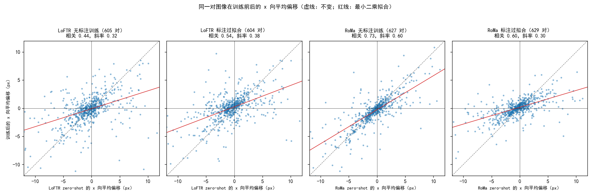
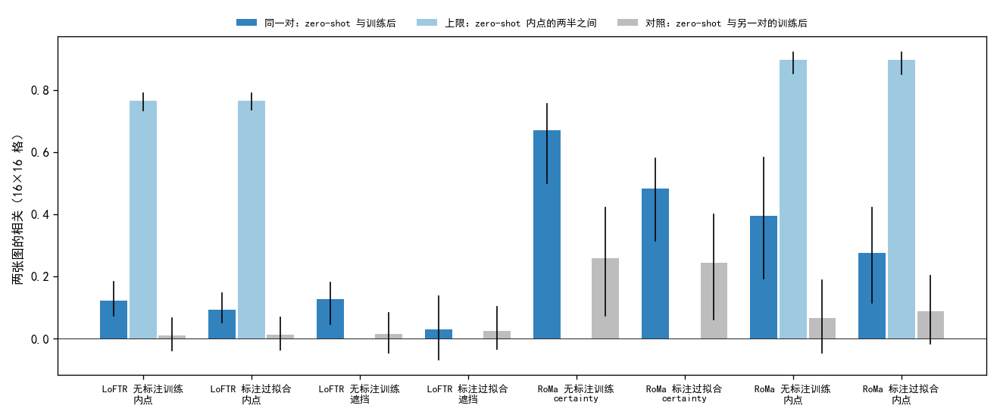
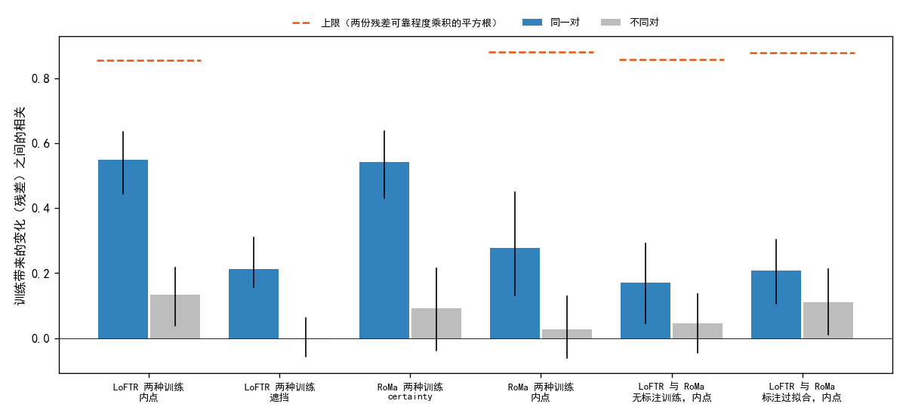

# 无标注训练改进局部匹配，标注训练改进仿射本身

**摘要**

无标注训练提高了光学–SAR 匹配的精度，但它改变了模型的哪些方面、与用标注训练是否改变同一类东西，还没有在同一批图像对上比较过。我们在 Val 的 652 对上，把 LoFTR 和 RoMa 的 zero-shot 模型与各自的无标注训练、标注过拟合模型逐对比较，比较对象包括误差的组成、标注陨石坑处的局部匹配，以及模型依赖的区域。两种训练都修好了大部分粗错，并让误差的各部分按原有比例下降。在陨石坑处，两者分道：LoFTR 无标注训练把局部匹配的 x 向均方误差减半，却几乎没有传到输出的仿射上；标注过拟合的局部匹配基本不变，仿射却明显靠近标注。依赖的区域被训练大幅改变：在同一种来源上两种训练方向一致，同一网络的两种训练改动同一些位置；但标注过拟合并没有让依赖区域比无标注训练更靠近标注点。对仿射对整张图拟合的模型来说，继续改进匹配可能难以再提高陨石坑处的精度。

**引言**

此前两次分析描述了单个模型的误差。拆分误差的分析发现，标注点处 x 向误差的大头来自仿射在别处拟合，而不是匹配本身；依赖区域的分析发现，模型依赖纹理强的区域，依赖区域离标注点的远近与误差无关。两个结论在 zero-shot、无标注训练和标注过拟合的模型上大体一致。

这些结论描述的是训练之后的状态，而不是训练带来的变化。无标注训练提高了 Val AUC@5，但它在同一对图像上改了什么，没有直接比较过；用标注训练得更好的模型改的是否也是这些，同样不清楚。若两者改的是同一类东西，无标注训练只需走得更远；若不同，它缺的就是标注训练改了的那一类。

我们在同一批图像对上逐对比较训练前后的模型，先看误差怎么变，再看依赖的区域怎么变，并检验两种训练是否让同一批对朝同一方向变。

**方法**

*模型与数据。* 6 个模型与上述两次分析相同，LoFTR 和 RoMa 各三个：AnyMatch 发布的权重（下称 zero-shot；RoMa 的 SAR 输入逐 patch min–max 拉伸）；在其上不用标注训练得最好的模型（下称无标注训练；LoFTR 用粗级闭式期望加负样本对，第 1500 步；RoMa 用自己打的伪标签，第 2000 步）；用 Val+Test 标注训练的模型（下称标注过拟合；LoFTR 学习率 5e-5，RoMa 解冻 VGG）。标注过拟合的模型在 Val 上见过标注，只作参照。我们比较四组：每种网络从 zero-shot 到无标注训练、从 zero-shot 到标注过拟合。所有统计都在 Val 中 652 个有标注的对上做，只读已有结果。

*误差的组成。* 一对图像在各标注点上的误差是光学标注点经仿射映射后减去 SAR 标注点。各点误差的平均称为平均偏移，减去它后剩下的称为平移以外的误差；一对的均方误差恰好是两者之和，按 x、y 分开得到四个部分。平均偏移某一轴超过 20 px 的对视为粗错。每组只用训练前后都不是粗错、也没有失败的对。

*陨石坑处的局部匹配。* 局部对应是模型在每个标注点处自己给出的匹配位置：LoFTR 取标注点 12 px 内匹配位移的中位数，RoMa 对稠密对应插值。我们在标注点上比较三种 x 向误差：模型输出的仿射（模型仿射）、用局部对应拟合的仿射、局部对应本身。为使模型之间可比，只用 6 个模型都有局部对应的 291 对、1536 个点；在这些点上，用标注拟合的仿射的 x 向均方误差是 5.7 px²。

*两种训练是否同向。* 两者各自的「训练后减 zero-shot」共用同一个 zero-shot 项，直接相关会虚高。我们因此把每个训练后模型的量对它的 zero-shot 做线性回归，取残差，即训练带来的、zero-shot 预测不了的部分，再算两份残差的相关（残差相关）。对照是 LoFTR 与 RoMa 之间的残差相关：两者网络和起点都不同，共有的变化只能来自图像对本身。

*依赖的区域。* 重要性图取自依赖区域的分析的那次推理，都在光学图上，统一成和为 1 的格图。LoFTR 用两种来源：RANSAC 内点在各格的个数（内点），以及 60 对上逐块遮住图像后仿射的变化（遮挡）；RoMa 用 certainty 和内点。LoFTR 的注意力在同一对与不同对之间几乎一样相似，主要反映与图像无关的共同布局，RoMa 的遮挡被噪声主导，这里都不用。三个量沿用依赖区域的分析的定义，在 32×32 格上计算：集中程度（累计到一半重要性所需的面积比例，越小越集中）、纹理偏好（重要区域比其余区域纹理强出的比例）、距离比（重要性加权的到最近标注点的距离，除以均匀分布下的这一距离，越小越靠近标注点）。训练后内点多出约 10 倍（LoFTR 中位 207 个增加到约 2000 个），点多了图自然铺开，所以每对把同一网络三个模型的内点随机抽到三者中最少的个数，抽 20 次取平均（点数对齐）。配对变化用符号秩检验。

*训练前后的相似度。* 两张图在 16×16 格上用 Pearson 相关比较（内点在 32×32 格上太稀，遮挡本来就是 16×16 块）。对照是 zero-shot 的这一对与另外 5 对训练后的图之间的相关。内点另有上限：把 zero-shot 的内点随机分成不重叠的两半，两半之间的相关，表示同一个模型、同样点数下两张图最多能有多像；比较时训练后的模型也抽同样个数。

*两种训练是否改动同一些位置。* 每张训练后的图对同一对的 zero-shot 图做线性回归，取残差，即训练带来的、zero-shot 预测不了的部分；再比较两种训练的残差在同一对上的相关与不同对之间的相关。内点图有抽样噪声，两种训练若对同一张 zero-shot 图回归，共用的噪声会抬高相关；所以两种训练分别对 zero-shot 内点不重叠的两半回归，斜率用另一半估计（工具变量），以免被噪声压低，重复 10 次取平均。残差的可靠程度用训练后内点的两半估计，两份残差相关的上限约为两者可靠程度乘积的平方根。对照是 LoFTR 与 RoMa 的内点残差在同一对上的相关：两者网络和起点都不同。

*与误差的关系。* 各量的逐对变化与两种误差变化的秩相关：误差是那次推理的仿射在标注点上的平均距离，取对数；在 291 对公共点上，另看模型仿射与局部对应拟合的仿射之差（两者 x 向均方误差之差）。

**结果**

***两种训练让误差的各部分按原有比例下降。*** 训练修好了大部分粗错（LoFTR 47 对降到 3 对，RoMa 23 对降到 9 对和 0 对），新出现的粗错只有 0–2 对。在其余对上，x 向平均偏移占降幅的 29–37%，与它在误差中所占的 16–30% 相近；训练没有专门去掉平均偏移。无标注训练与标注过拟合的降幅构成几乎相同。


| 比较             | 粗错和失败（对）前 → 后 | 比较的对数 | 均方误差（px²）前 → 后 | x 向平均偏移占降幅 | x 向平移以外的误差占降幅 | y 向两部分占降幅 |
| ---------------- | ------------------------ | ---------- | ------------------------ | ------------------ | ------------------------ | ---------------- |
| LoFTR 无标注训练 | 47 → 3                  | 605        | 63.7 → 40.7             | 37%                | 59%                      | 4%               |
| LoFTR 标注过拟合 | 47 → 3                  | 604        | 63.5 → 37.7             | 35%                | 60%                      | 5%               |
| RoMa 无标注训练  | 23 → 9                  | 627        | 54.0 → 39.6             | 29%                | 53%                      | 18%              |
| RoMa 标注过拟合  | 23 → 0                  | 629        | 55.5 → 25.5             | 37%                | 54%                      | 9%               |

表 1：训练前后的误差组成。

*每对的平均偏移变小，但方向保留。* x 向平均偏移的标准差，LoFTR 从 4.2 px 降到 3.1 px 和 3.0 px，RoMa 从 3.7–3.8 px 降到 3.0 px 和 1.9 px。训练前后都超过 1 px 的对中，81–94% 同号。



图 1：同一对的 x 向平均偏移在训练前后同号。回归斜率 0.30–0.60 被 zero-shot 偏移中的 RANSAC 抖动（0.6–1.8 px）压低，变化幅度以标准差为准。

***在陨石坑处，无标注训练改进局部匹配，标注过拟合改进仿射。*** LoFTR 无标注训练把局部对应的均方误差从 6.2 降到 2.9 px²（77% 的对变好，p < 10⁻²⁴），局部对应拟合的仿射也随之变好；模型仿射却只从 23.5 降到 21.9，它与局部对应拟合的仿射之差没有缩小（14.1 到 14.5 px²）。两个标注过拟合的模型相反：局部匹配逐对看没有显著变化（p 0.12–0.73），模型仿射却明显变好，它与局部对应拟合的仿射之差，LoFTR 从 14.1 缩到 10.7 px²，RoMa 从 17.6 缩到 4.7 px²。RoMa 无标注训练介于两者之间。


| 模型             | 模型仿射    | 局部对应拟合的仿射 | 局部对应本身 |
| ---------------- | ----------- | ------------------ | ------------ |
| LoFTR zero-shot  | 23.5        | 9.4                | 6.2          |
| LoFTR 无标注训练 | 21.9（58%） | 7.3（70%）         | 2.9（77%）   |
| LoFTR 标注过拟合 | 19.3（60%） | 8.6（47%）         | 4.8（45%）   |
| RoMa zero-shot   | 26.7        | 9.1                | 5.2          |
| RoMa 无标注训练  | 22.8（62%） | 8.2（50%）         | 4.0（51%）   |
| RoMa 标注过拟合  | 14.0（71%） | 9.2（48%）         | 6.1（43%）   |

表 2：291 对公共点上的 x 向均方误差（px²），括号内为这一误差变小的对所占比例。

*同一网络的两种训练改变的是同一批对。* 扣掉 zero-shot 之后，同一网络两种训练的残差相关为 0.52–0.74，不同网络之间只有 0.27–0.34。


| 比较的两个模型                              | 对数 | x 向平均偏移的残差相关 | 误差（对数）的残差相关 |
| ------------------------------------------- | ---- | ---------------------- | ---------------------- |
| LoFTR 无标注训练 与 LoFTR 标注过拟合        | 604  | 0.61                   | 0.69                   |
| RoMa 无标注训练 与 RoMa 标注过拟合          | 627  | 0.52                   | 0.74                   |
| LoFTR 无标注训练 与 RoMa 无标注训练（对照） | 592  | 0.34                   | 0.31                   |
| LoFTR 标注过拟合 与 RoMa 标注过拟合（对照） | 592  | 0.27                   | 0.29                   |

表 3：训练带来的变化在模型之间的残差相关。

*训练大幅改变了模型依赖的区域，标注过拟合改得更多。* 在同一对上，LoFTR 训练前后的内点图几乎不相干：相关只有 0.12（无标注训练）和 0.09（标注过拟合），而 zero-shot 内点的两半之间有 0.77，不同对之间约 0.01。LoFTR 的遮挡图也是这样（0.13 和 0.03，不同对约 0.02）。RoMa 保留得多一些：certainty 为 0.67 和 0.48（不同对约 0.25），内点为 0.40 和 0.28（两半之间 0.90，不同对 0.07 和 0.09）。每种来源上，标注过拟合都离 zero-shot 更远。



图 2：训练前后重要性图的相关，同一对与上限、不同对比较（中位数与四分位）。

*同一种来源上两种训练方向一致，内点与 certainty、遮挡的方向相反。* 内点在两种网络上都变得铺开、离标注点更远、不再偏向纹理强的区域。点数对齐后这些变化依然存在：点数只解释了集中程度变化的一部分（LoFTR 不对齐时升到 0.146 和 0.163，                 对齐后为 0.062 和 0.063），纹理偏好和距离比几乎不受点数影响。certainty 和遮挡则变得更集中：RoMa 的 certainty 同时更靠近标注点、更不偏向纹理强的区域；LoFTR 的遮挡更偏向纹理强的区域，离标注点的远近没有显著变化。每种来源上两种训练方向相同；标注过拟合在 certainty 和遮挡上幅度更大，在内点上与无标注训练相当。除遮挡外，各项配对变化都是 p < 10⁻⁶。


| 比较             | 来源      | 集中程度 前 → 后      | 纹理偏好 前 → 后  | 距离比 前 → 后       |
| ---------------- | --------- | ---------------------- | ------------------ | --------------------- |
| LoFTR 无标注训练 | 内点      | 0.022 → 0.062（100%） | 31% → 3%（97%）   | 0.761 → 0.856（75%） |
| LoFTR 标注过拟合 | 内点      | 0.022 → 0.063（100%） | 31% → 0%（97%）   | 0.761 → 0.863（73%） |
| LoFTR 无标注训练 | 遮挡      | 0.118 → 0.104（63%）  | 0% → 11%（72%）   | 0.930 → 0.939（57%） |
| LoFTR 标注过拟合 | 遮挡      | 0.118 → 0.088（78%）  | 0% → 5%（62%）    | 0.930 → 0.902（58%） |
| RoMa 无标注训练  | certainty | 0.249 → 0.234（66%）  | 7% → 2%（71%）    | 0.915 → 0.875（77%） |
| RoMa 标注过拟合  | certainty | 0.249 → 0.190（67%）  | 7% → −11%（96%） | 0.915 → 0.867（70%） |
| RoMa 无标注训练  | 内点      | 0.171 → 0.222（96%）  | 2% → 0%（63%）    | 0.904 → 0.925（65%） |
| RoMa 标注过拟合  | 内点      | 0.171 → 0.228（92%）  | 2% → −6%（89%）  | 0.904 → 0.924（61%） |

表 4：依赖区域的三个量在训练前后的中位数，括号内为朝箭头方向变化的对所占比例。内点按点数对齐。遮挡只有 60 对：集中程度的 p 为 0.02 和 10⁻⁵，纹理偏好为 3×10⁻⁴ 和 0.03，距离比不显著（0.25 和 0.41）。

注：RoMa上的解释：

```
你的推理"抽样按 certainty 来，certainty 靠近标注点，内点也该靠近"本身没错。但 E4 推理里 RoMa 用的抽样方式，从三处切断了 certainty 的细节和最终内点位置之间的联系。我翻了 RoMa 的 sample()（romatch/models/matcher.py:468-495）和 E4 的调用（runs/E4/code/common.py:180）。下面按顺序说这三道环节，最后说哪些是推测、怎么核实。
第一道：阈值把 certainty 抹平了
RoMa 用的是 threshold_balanced 模式，阈值 0.05：
certainty[certainty > 0.05] = 1
只要 certainty 超过 0.05，不管是 0.1 还是 0.99，抽样时一律当成 1。我们算距离比用的是原始 certainty，它是高低起伏的连续图。"高 certainty 往标注点靠"指的就是这种起伏。抽样只区分"过不过 0.05"，看不到这些起伏。
第二道：KDE 平衡会故意把点打散
第一步先按上面的权重抽出 4×5000 个候选，接着做平衡抽样：
density = kde(good_matches, std=0.1)
p = 1 / (density + 1)
候选越密的地方，被选中的概率越低。目的就是让最终的 5000 个点在图上铺得尽量均匀。certainty 往哪里聚，这一步就往反方向拉。
第三道：RANSAC 只认"符合同一个仿射"
5000 个点再经过 RANSAC，留下的内点由"这个点的对应和整体仿射一致不一致"决定，跟 certainty 高低和是否靠近标注点都没有直接关系。训练后对应质量整体变好，全图各处都有更多点能通过。这和内点"变得铺开、不再偏向纹理"一致。合起来看certainty 图描述的是"模型觉得哪里最可靠"，并且有程度之分。内点描述的是"阈值以上的区域里，打散后又和仿射一致的点在哪"。
```

*同一网络的两种训练改动同一些位置，跨网络很少。* 扣掉 zero-shot 之后，同一网络两种训练的残差在同一对上的相关为：LoFTR 内点 0.55、遮挡 0.21，RoMa certainty 0.54、内点 0.28；不同对之间为 0 到 0.13，91–98% 的对高于不同对的中位数。LoFTR 与 RoMa 的内点残差在同一对上只有 0.17（两个无标注训练）和 0.21（两个标注过拟合），不同对为 0.05 和 0.11。四个训练后模型内点残差的可靠程度为 0.85–0.89，同网络与跨网络的相关上限都在 0.85–0.88，两者的差别因此不来自噪声。



图 3：训练带来的变化在同一网络两种训练之间、在 LoFTR 与 RoMa 之间的相关，同一对与不同对比较；虚线为噪声决定的上限。

*依赖区域离标注点越远，误差降得越少，但这与仿射是否靠近标注关系很弱。* 在内点和 certainty 上，距离比变大的对误差降得少：内点上秩相关为 0.29 和 0.31（LoFTR）、0.27 和 0.23（RoMa），certainty 上为 0.16 和 0.16；遮挡上没有关系（0.03 和 0.09，60 对）。标注过拟合把模型仿射与局部对应拟合的仿射之差缩得最多（291 对公共点上，按那次推理的仿射，LoFTR 从 14.2 到 11.2 px²，RoMa 从 17.7 到 5.4 px²；无标注训练为 16.6 和 13.2 px²），但它的依赖区域并不比无标注训练更靠近标注点（内点距离比 0.863 对 0.856、0.924 对 0.925，certainty 0.867 对 0.875）。逐对看，距离比的变化与这一差的变化在内点和 certainty 上的秩相关只有 −0.04 到 0.17。

**讨论**

我们问的是训练改变了模型的什么，有标注与无标注的训练改的是否相同。在依赖的区域上，两者改的是同一类东西：同一种来源上方向相同，改动的位置也相同，这些改动主要随网络而定。在陨石坑处的误差上，两者不同：LoFTR 无标注训练改进的是局部匹配，标注过拟合改进的是仿射本身。

这一差别与拆分误差的分析一致。仿射对整张图拟合时，陨石坑处局部匹配的改进被别处的匹配稀释，传不到仿射上；标注过拟合以标注拟合的仿射为训练目标，直接把仿射拉向标注处。由此推测，在当前的仿射输出方式下，无标注训练继续改进匹配，对陨石坑处精度的帮助有限。依赖区域的结果与此一致：标注过拟合把仿射拉向标注，却没有让依赖区域比无标注训练更靠近标注点，距离比的变化与仿射和局部对应拟合的仿射之差的变化也只有很弱的关系；至少按离标注点的远近衡量，仿射靠近标注不是靠挪动依赖区域做到的。

结论有五点局限。每种训练只有一个模型、一个存档，没有种子之间的比较。标注过拟合的模型在 Val 上见过标注，它与无标注训练的差别里有一部分来自见过评测数据。局部对应不是对陨石坑的精确定位，LoFTR zero-shot 的局部对应只覆盖约一半标注点，公共点集只有 291 对。zero-shot 的量带有 RANSAC 抖动，部分与图像有关的成分会留在残差里，同一网络两种训练之间的残差相关可能因此偏高。依赖区域只按离标注点的远近衡量，没有区分落在什么地物上；遮挡只有 60 对、每个模型只测一次，它的残差没有校正噪声。

对无标注训练而言，这些结果指向输出方式而不是匹配本身：若能让仿射更多地由陨石坑一类的区域决定，局部匹配已有的改进才可能传到评测上。这需要在不知道标注位置的前提下做到，是下一步值得检验的方向。
