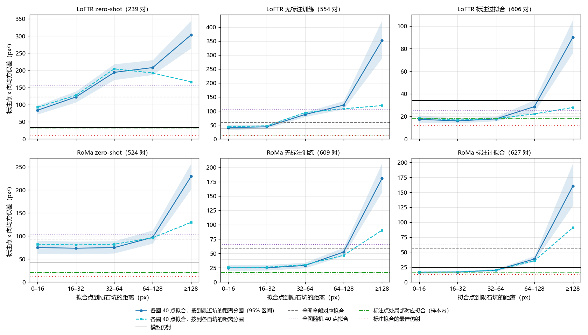
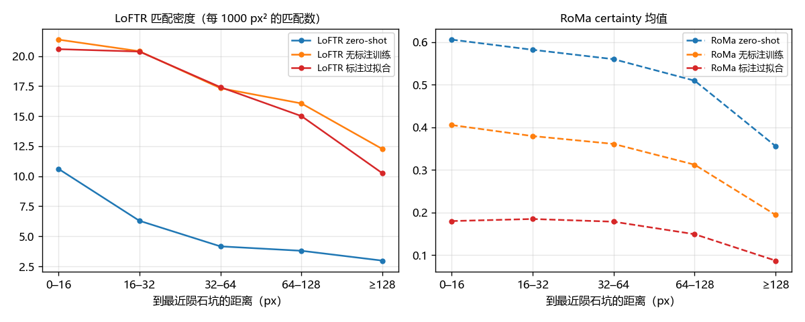

# 在陨石坑 32 px 内拟合的仿射与在坑上拟合一样准

**摘要**

此前的两次误差分析得出了相互矛盾的结论。一次发现，仿射改在标注点处、用模型自己在那里的对应拟合，标注点的 x 向均方误差能降 55–66%，说明用哪些位置的对应拟合，决定了仿射在陨石坑处准不准。另一次却发现，模型依赖的区域离标注点的远近与误差无关；但它用的是注意力、内点这类间接指标，而且是在不同的对之间算相关。本实验直接检验：在 Val 的 652 对上，对 6 个 LoFTR 和 RoMa 模型，从离陨石坑标注由近到远的五个距离圈里各取 40 个对应，用最小二乘拟合仿射，再在全部标注点上量误差。在 RoMa 无标注训练和两个标注过拟合的模型上，离坑 32 px 以内拟合的误差接近在标注点处拟合，比模型仿射低 33–49%；离坑更远，误差逐渐变大，128 px 以上成倍增加。两个 zero-shot 模型和 LoFTR 无标注训练则在任何位置拟合都不如模型仿射。因此，对这三个训练过的模型，拟合点离陨石坑的远近确实决定了仿射在陨石坑处的误差。

**引言**

LoFTR 和 RoMa 在本数据集上的误差，有很大一部分是整对仿射在标注点处的偏差。此前的误差分解显示，x 向均方误差的 59–80% 来自模型仿射与「在标注点处用局部对应拟合的仿射」之差：同一个模型，若改在标注点处、用它自己在那里给出的对应来拟合仿射，误差能降 55–66%。由此得出的解释是：两张图之间的形变不是严格的仿射；模型的仿射由全图的对应决定，在陨石坑处就会偏；用哪些位置的对应来拟合，决定了仿射在陨石坑处准不准。

另一次分析的结论与此不同。它给每对图画出模型依赖的区域，发现控制标注点的疏密之后，依赖区域离标注点的远近与误差没有正相关。按上面的解释，依赖区域离陨石坑越远，误差应当越大。不过这次分析衡量依赖区域用的是注意力、certainty、内点这类间接指标，它们未必反映仿射实际由哪些对应决定；相关也是在不同的对之间算的，各对的形变和纹理不同，可能掩盖距离的作用。

本实验改用更直接的办法：在同一对图上直接控制拟合点到陨石坑的距离，每次拟合都用同样多的点，看陨石坑处的误差是否随距离变化。离坑很近的点，网络给出的对应应当与坑上的相近；如果上面的解释成立，在坑旁拟合应接近在坑上拟合，离坑越远误差越大。

**方法**

*模型与数据。* 6 个模型是 LoFTR 和 RoMa 各三个：AnyMatch 发布的权重（下称 zero-shot）；在其上不用标注训练得最好的模型（下称无标注训练；LoFTR 用粗级闭式期望加负样本对，第 1500 步；RoMa 用自己打的伪标签，第 2000 步）；用 Val+Test 标注训练的模型（下称标注过拟合；LoFTR 学习率 5e-5，RoMa 解冻 VGG）。标注过拟合的模型在 Val 上见过标注，只作参照。所有统计都在 Val 中 652 个有标注的对上做，只推理、不训练。每对平均有 8–9 个陨石坑标注。

*对应。* 每个模型推理一次，存下全图的对应。LoFTR 取它输出的全部匹配（zero-shot 每对中位约 860 个，训练后约 4000 个）。RoMa 取网络的稠密对应：光学图上每个位置都对应 SAR 图上的一点，要用的位置由网格双线性插值得到，同时记下该处的 certainty。

*距离圈。* 以光学图上的陨石坑标注为中心，按距离分为五圈：0–16、16–32、32–64、64–128、128 px 以上，超出图像的部分截掉。主口径按「到最近陨石坑的距离」分圈，每个位置归离它最近的坑，这样外圈不会落到别的坑旁边。副口径按到每个坑各自的距离分圈，一个位置可以同时属于几个坑的圈。

*拟合。* 在某一圈里，每次共取 40 个对应，各坑平分；某个坑在这一圈里的对应不够，差额平分给同一对里其余的坑；整对凑不满 40 个，这一圈就不计这一对。40 个对应用普通最小二乘拟合仿射。每圈随机抽 20 次。

*误差。* 拟合出的仿射在这一对的全部标注点上量误差，即标注点经仿射映射后与 SAR 标注之差。主指标是 x 向均方误差：每个标注点的 x 向误差平方先在 20 次抽样之间平均，再对所有对的所有标注点平均，与此前分解所用的定义相同。同时报告 x 向误差绝对值的中位数。一次拟合在标注点上的平均偏移有一轴超过 20 px，记为粗错，不进误差。模型仿射本身失败或平均偏移超过 20 px 的对整对不计（6 个模型分别去掉 0–47 对）。

*参照线。* 在同一批对、同一批标注点上比较五种仿射：模型仿射，即评测所用的仿射；用全图全部对应拟合的仿射；从全图随机取 40 个对应拟合的仿射（抽 20 次）；在标注点处用局部对应拟合的仿射（样本内，做法同此前的分解：LoFTR 取标注点 12 px 内匹配位移的中位数，至少 3 个，RoMa 取稠密对应在标注点处的值；离标注 20 px 以上的不用，至少 4 点）；用标注拟合的最佳仿射（样本内）。除模型仿射外，都用普通最小二乘拟合。

*统计。* 主图只用五圈都可用、且五种参照都可用的对。95% 区间由按对的自助抽样（1000 次）得到；各圈与最内圈之差也在同一批对上自助抽样。对应的质量只作描述，不作配平：LoFTR 用圈内的匹配密度，RoMa 用圈内 certainty 的均值。

*可复现性。* 推理在 V100 上进行。四个模型的仿射与评测记录逐对一致；两个标注过拟合的模型原先在别的 GPU 上评测，逐对相差中位 0.4–0.7 px。下文的误差都按本次推理的仿射计算。

**结果**

***在陨石坑旁拟合与在坑上拟合一样准。*** 在 0–16 px 一圈拟合，LoFTR 标注过拟合的 x 向均方误差为 17.3 px²，RoMa 标注过拟合为 16.3 px²，与样本内拟合的 18.3、16.4 px² 相当，比模型仿射（34.0、24.4 px²）低 49% 和 33%（表 1）。RoMa 无标注训练为 24.7 px²，介于样本内拟合（16.5 px²）与模型仿射（38.5 px²）之间，比模型仿射低 36%。三个模型在 16–32 px 一圈保持同一水平（16.0–24.9 px²）。

图 1：离陨石坑 32 px 以内拟合，三个训练过的模型误差接近样本内拟合；再远误差逐渐变大。每个子图是一个模型；蓝线和阴影是各圈 40 点拟合的 x 向均方误差及其 95% 区间，青色虚线是按到各自坑的距离分圈的结果，水平线是五种参照。标题里是参与比较的对数。

| 模型 | 0–16 px | 16–32 px | 32–64 px | 64–128 px | ≥128 px | 模型仿射 | 样本内局部拟合 | 标注拟合的最佳仿射 |
|---|---|---|---|---|---|---|---|---|
| LoFTR zero-shot | 83.4 | 122.1 | 193.9 | 207.8 | 303.3 | 33.6 | 31.4 | 9.4 |
| LoFTR 无标注训练 | 40.3 | 43.3 | 87.5 | 120.8 | 352.0 | 38.5 | 14.5 | 11.9 |
| LoFTR 标注过拟合 | 17.3 | 16.0 | 17.7 | 28.6 | 90.1 | 34.0 | 18.3 | 12.1 |
| RoMa zero-shot | 74.8 | 73.4 | 74.8 | 97.0 | 229.3 | 43.1 | 20.5 | 11.4 |
| RoMa 无标注训练 | 24.7 | 24.9 | 29.0 | 52.3 | 180.7 | 38.5 | 16.5 | 12.2 |
| RoMa 标注过拟合 | 16.3 | 16.6 | 19.7 | 38.6 | 160.3 | 24.4 | 16.4 | 12.4 |

表 1：三个训练过的模型在离坑 32 px 以内拟合，误差接近样本内拟合。数值为标注点的 x 向均方误差（px²），在五圈与各参照都可用的对上计算（LoFTR zero-shot 239 对，其余 524–627 对）。

***离陨石坑越远，误差越大。*** 以最内圈为基准，16–32 px 一圈在训练过的四个模型上相差 −1.3 到 +1.7 px²；32–64 px 一圈，RoMa 的两个训练模型高 3–4 px²（区间都不含 0），LoFTR 标注过拟合不变；64–128 px 一圈，六个模型都更高（LoFTR 标注过拟合 +11 px²，RoMa 两个训练模型 +22 到 +28 px²）；128 px 以上，误差成倍增加（例如 RoMa 无标注训练从 25 升到 181 px²）。在图 1 的三个模型上，x 向中位数从 2.1–2.2 px 升到 3.8–5.0 px。按到各自坑的距离分圈时，外圈混入了别的坑附近的位置，误差的上升小得多（RoMa 无标注训练 128 px 以上为 90 px²）。

这一上升不全是形变造成的。同一段距离上，对应的质量也在下降（图 2）：训练过的两个 LoFTR 的匹配密度从每 1000 px² 约 21 个降到 10–12 个，RoMa 的 certainty 均值降到最内圈的一半到六成。128 px 以上的位置远离所有陨石坑，在每对图上只剩零星几块，40 个点挤在一起，外推到坑处的误差也会放大。在 32 px 以内，密度与 certainty 几乎不变（例如 RoMa 标注过拟合为 0.180 与 0.185），误差也几乎不变；更远处误差的上升里，形变与对应质量各占多少，本实验分不开。

图 2：离陨石坑越远，对应越稀、越不确定。左：LoFTR 圈内的匹配密度；右：RoMa 圈内 certainty 的均值。

***两个 zero-shot 模型和 LoFTR 无标注训练在任何位置拟合都不如模型仿射。*** 这三个模型在最内圈为 40–83 px²，不低于模型仿射（34–43 px²），误差随距离上升得也快得多（LoFTR zero-shot 在 32–64 px 已达 194 px²）；用全图全部对应拟合同样更差（59–122 px²）。最小二乘对错误的对应很敏感，推测这三个模型的对应中错误匹配较多，未经验证。LoFTR zero-shot 的匹配稀疏，有 115 对凑不满最内圈的 40 个点，它的结果只来自 239 对。

**讨论**

本实验检验了「拟合点离陨石坑越近，仿射在陨石坑处越准」。在三个训练过的模型上，结果支持它：离坑 32 px 以内的 40 个对应拟合出的仿射，误差接近在坑上拟合，比模型仿射低三到五成；离坑越远误差越大。网络在坑旁 32 px 以内给出的对应与坑上的相近，所以在坑旁拟合就能得到在坑上拟合的效果。这与此前误差分解的解释一致，与「依赖区域的远近与误差无关」的结论不同。后者没有发现这一关系，可能是因为注意力、内点这类指标不反映仿射实际由哪些对应决定，或者跨对的差异掩盖了距离的作用，未经验证。

结论有三点局限。第一，32 px 以外误差上升的同时，对应变稀、变得不确定，远处的点也挤成几块，本实验分不清形变随距离的变化与对应质量各占多少。第二，两个 zero-shot 模型和 LoFTR 无标注训练没有表现出这一优势，原因推测是错误匹配较多，未经验证。第三，在坑旁拟合需要事先知道陨石坑的位置；本实验用的是标注，不用标注能否找到这些位置，没有检验。

对后续研究，这一结果意味着：训练过的模型在陨石坑附近给出的对应，已经足以拟合出比现有输出准得多的仿射；误差的大头在于仿射用哪些位置的对应来拟合，而不在匹配本身。值得检验的是，不用标注能否让仿射更多依赖陨石坑一带的对应，以及对 zero-shot 模型，先去掉错误匹配后能否得到同样的效果。
